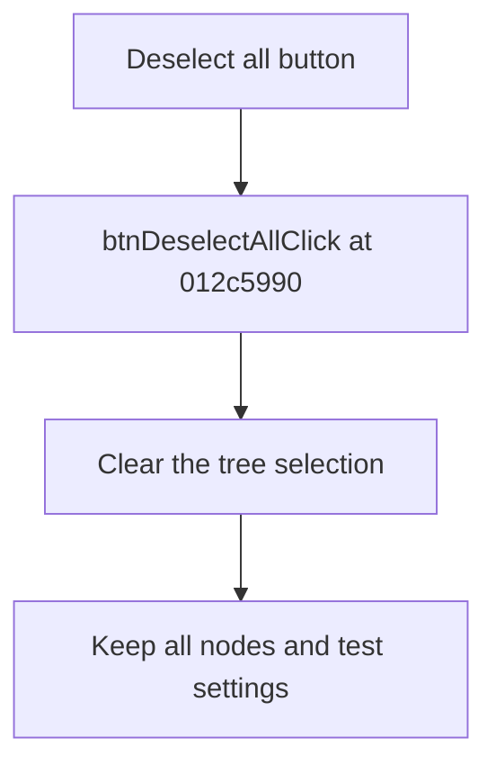

# Deselect all

> Analysis status: Reviewed from recovered source and UI evidence.

## Control

| Property | Recovered value |
| --- | --- |
| Component path | `frmTestBenchEditor.pnlMain.pnlFileSelector.pnlSelectors.btnDeselectAll` |
| Control class | `TButton` |
| Handler | `btnDeselectAllClick` at `012c5990` |

## What happens when clicked

The handler sends the tree view a clear-selection request. It does not change the tree nodes or their test settings and has no error path.

## Click flow

## Evidence

- [Recovered btnDeselectAllClick source](../../../DecompiledSources/Tina16/functions/00000000012C5990__FUN_012c5990.c)
- The DFM resource supplies the control identity, caption or state, and event binding.
- No extracted glyph is present for this control.

## Analysis limits

- The lower-level tree method name is not recovered, but the false argument and the parallel select and invert handlers establish selection clearing.
