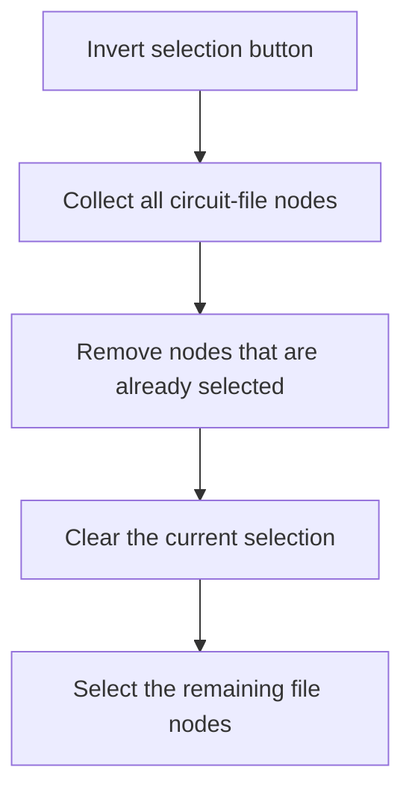

# Invert selection

> Analysis status: Reviewed from recovered source and UI evidence.

## Control

| Property | Recovered value |
| --- | --- |
| Component path | `frmTestBenchEditor.pnlMain.pnlFileSelector.pnlSelectors.btnInvertSelection` |
| Control class | `TButton` |
| Handler | `btnInvertSelectionClick` at `012c59b0` |

## What happens when clicked

The handler builds a temporary list of all tree nodes marked as circuit files. It removes nodes that are already selected, clears the current tree selection, and selects the remaining file nodes. Folder nodes are not added to the temporary list. Therefore, the new selection is the inverse of the prior selection for circuit-file nodes only.

## Click flow

## Evidence

- [Recovered btnInvertSelectionClick source](../../../DecompiledSources/Tina16/functions/00000000012C59B0__FUN_012c59b0.c)
- [Recovered TSC folder scan](../../../DecompiledSources/Tina16/functions/00000000012C7620__FUN_012c7620.c)
- The DFM resource supplies the control identity, caption or state, and event binding.
- No extracted glyph is present for this control.

## Analysis limits

- The handler does not report a message when the tree contains no circuit-file node.
