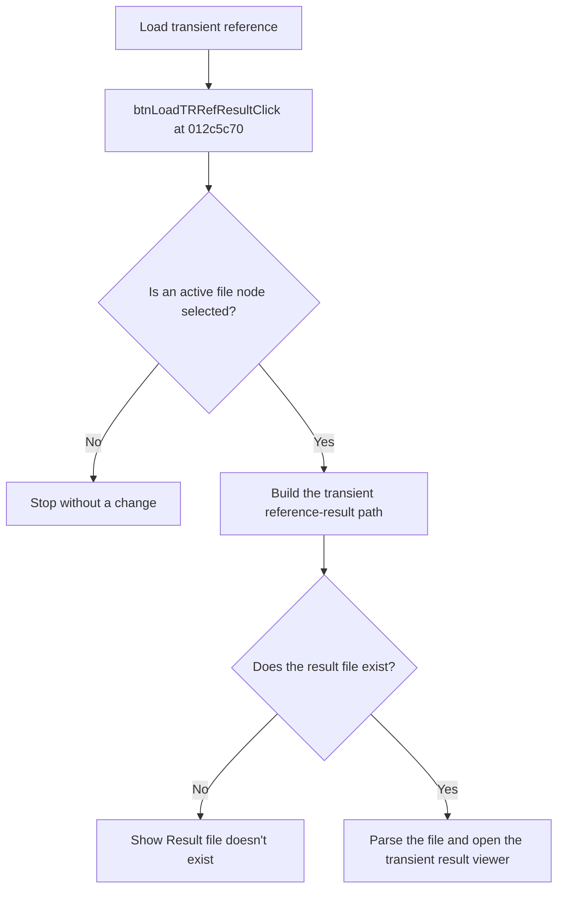

# Load reference

> Analysis status: Reviewed from recovered source and UI evidence.

## Control

| Property | Recovered value |
| --- | --- |
| Component path | `frmTestBenchEditor.pnlMain.pnlTestOptions.pctrlMode.tsTR.grbxTR.btnLoadTRRefResult` |
| Control class | `TButton` |
| Handler | `btnLoadTRRefResultClick` at `012c5c70` |

## What happens when clicked

The handler requires an active file node in the circuit tree. If no active file exists, it stops. It builds the transient reference-result path below the selected result folder. It uses the selected circuit folder and file name, adds `.corner` when the transient corner-test option is selected, and adds `.refresult.tr`. If the file does not exist, the application shows `Result file doesn't exist`. If the file exists, the application parses it and opens the transient result viewer.

## Click flow

## Evidence

- [Recovered btnLoadTRRefResultClick source](../../../DecompiledSources/Tina16/functions/00000000012C5C70__FUN_012c5c70.c)
- [Recovered result-path builder](../../../DecompiledSources/Tina16/functions/00000000012CB590__FUN_012cb590.c)
- [Recovered result-file loader](../../../DecompiledSources/Tina16/functions/00000000012CB240__FUN_012cb240.c)
- The DFM resource supplies the control identity, caption, and event binding.
- No extracted glyph is present for this control.

## Analysis limits

- The recovered code does not identify the user-facing class name of the transient result viewer.
