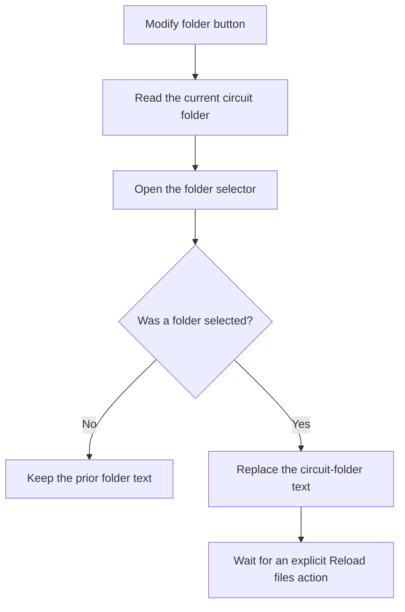

# Modify folder

> Analysis status: Reviewed from recovered source and UI evidence.

## Control

| Property | Recovered value |
| --- | --- |
| Component path | `frmTestBenchEditor.pnlMain.pnlFileSelector.pnlSetRoot.btnModifyCircuitFolder` |
| Control class | `TButton` |
| Handler | `btnModifyCircuitFolderClick` at `012c5630` |

## What happens when clicked

The handler reads the current circuit-folder text and opens a folder selector with that value. If the user accepts, it replaces the circuit-folder text. If the user cancels, it keeps the prior text. This click does not reload the file tree; the separate `Reload files` button performs that operation.

## Click flow

## Evidence

- [Recovered btnModifyCircuitFolderClick source](../../../DecompiledSources/Tina16/functions/00000000012C5630__FUN_012c5630.c)
- [Recovered Reload files handler](../../../DecompiledSources/Tina16/functions/00000000012C56C0__FUN_012c56c0.c)
- The DFM resource supplies the control identity, caption or state, and event binding.
- No extracted glyph is present for this control.

## Analysis limits

- The handler does not test folder readability or rescan files.
