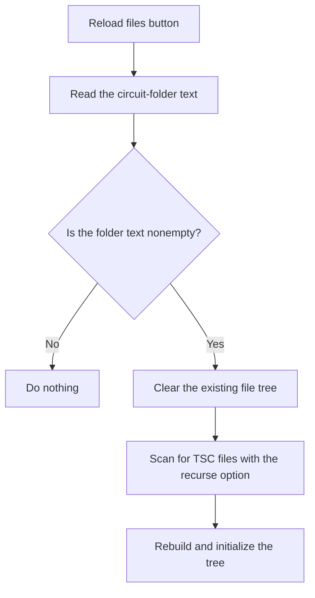

# Reload files

> Analysis status: Reviewed from recovered source and UI evidence.

## Control

| Property | Recovered value |
| --- | --- |
| Component path | `frmTestBenchEditor.pnlMain.pnlFileSelector.pnlSetRoot.btnReloadFiles` |
| Control class | `TButton` |
| Handler | `btnReloadFilesClick` at `012c56c0` |

## What happens when clicked

The handler reads the circuit-folder field. If it is empty, the click has no effect. Otherwise, it clears the existing tree, creates a new root node, and scans the folder for `.TSC` circuit files. The `Recurse subfolders` check box controls recursive scanning. It rebuilds and selects the initial tree node after the scan. No local error message is present.

## Click flow

## Evidence

- [Recovered btnReloadFilesClick source](../../../DecompiledSources/Tina16/functions/00000000012C56C0__FUN_012c56c0.c)
- [Recovered TSC folder scan](../../../DecompiledSources/Tina16/functions/00000000012C7620__FUN_012c7620.c)
- The DFM resource supplies the control identity, caption or state, and event binding.
- No extracted glyph is present for this control.

## Analysis limits

- The recovered path does not distinguish an empty folder from an inaccessible folder with a local message.
