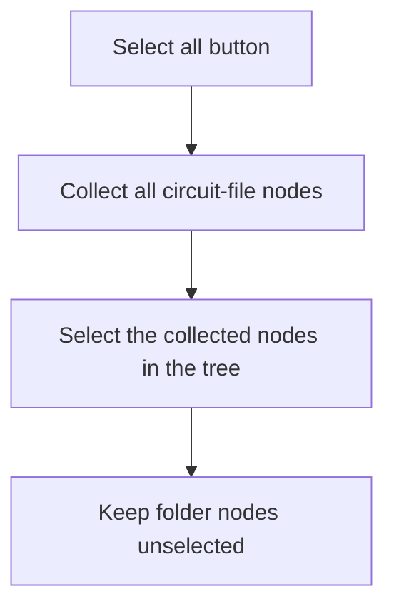

# Select all

> Analysis status: Reviewed from recovered source and UI evidence.

## Control

| Property | Recovered value |
| --- | --- |
| Component path | `frmTestBenchEditor.pnlMain.pnlFileSelector.pnlSelectors.btnSelectAll` |
| Control class | `TButton` |
| Handler | `btnSelectAllClick` at `012c58e0` |

## What happens when clicked

The handler collects every tree node marked as a circuit file and passes that list to the tree selection setter. Folder nodes are not selected. It does not change any test settings and has no error path.

## Click flow

## Evidence

- [Recovered btnSelectAllClick source](../../../DecompiledSources/Tina16/functions/00000000012C58E0__FUN_012c58e0.c)
- [Recovered TSC folder scan](../../../DecompiledSources/Tina16/functions/00000000012C7620__FUN_012c7620.c)
- The DFM resource supplies the control identity, caption or state, and event binding.
- No extracted glyph is present for this control.

## Analysis limits

- The handler does not report a message when the tree contains no circuit-file node.
