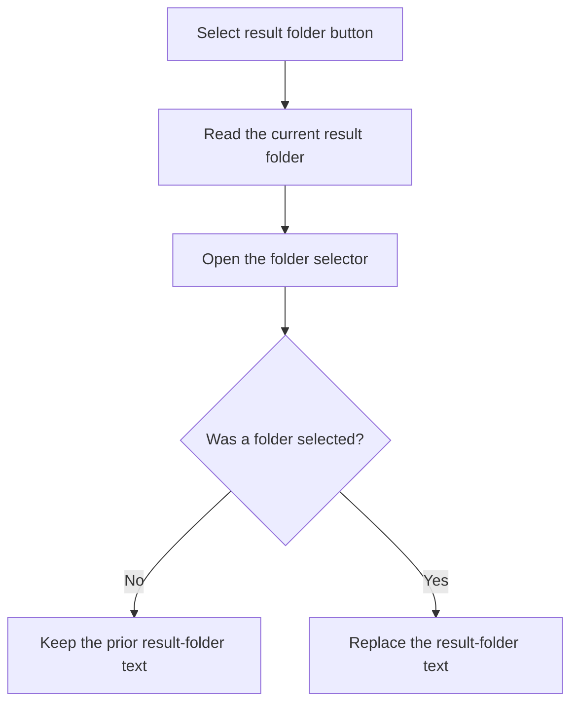

# Select folder

> Analysis status: Reviewed from recovered source and UI evidence.

## Control

| Property | Recovered value |
| --- | --- |
| Component path | `frmTestBenchEditor.pnlMain.pnlFileSelector.pnlSetRoot.btnSelectResultFolder` |
| Control class | `TButton` |
| Handler | `btnSelectResultFolderClick` at `012c5850` |

## What happens when clicked

The handler reads the current result-folder text and opens a folder selector with that value. If the user accepts, it replaces the result-folder text. If the user cancels, it keeps the prior text. It does not create the folder, load a result, or run a test.

## Click flow

## Evidence

- [Recovered btnSelectResultFolderClick source](../../../DecompiledSources/Tina16/functions/00000000012C5850__FUN_012c5850.c)
- The DFM resource supplies the control identity, caption or state, and event binding.
- No extracted glyph is present for this control.

## Analysis limits

- The handler does not test whether the selected folder is writable.
