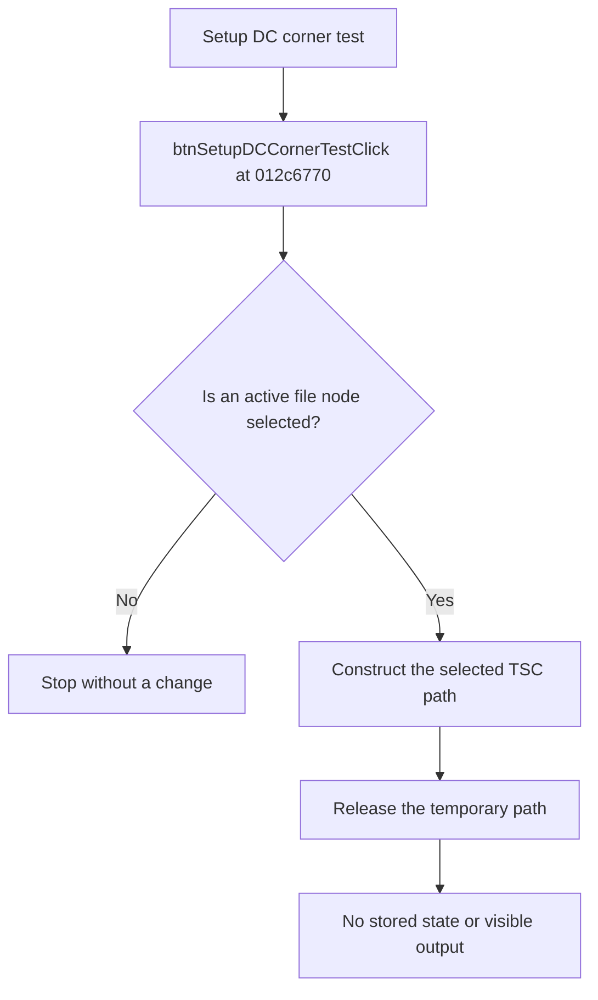

# Setup corner test

> Analysis status: Reviewed from recovered source and UI evidence.

## Control

| Property | Recovered value |
| --- | --- |
| Component path | `frmTestBenchEditor.pnlMain.pnlTestOptions.pctrlMode.tsDC.grbxDC.btnSetupDCCornerTest` |
| Control class | `TButton` |
| Handler | `btnSetupDCCornerTestClick` at `012c6770` |

## What happens when clicked

The handler requires an active file node in the circuit tree. For a file node, it constructs the full `.TSC` circuit path from the circuit folder and the tree hierarchy. It then releases the temporary path. The recovered handler does not store the path, call another application function, open a window, or change form state. The click therefore has no persistent or visible effect in the recovered implementation.

## Click flow

## Evidence

- [Recovered btnSetupDCCornerTestClick source](../../../DecompiledSources/Tina16/functions/00000000012C6770__FUN_012c6770.c)
- The DFM resource supplies the control identity, caption, and event binding.
- No extracted glyph is present for this control.

## Analysis limits

- The caption suggests an intended setup operation, but the recovered click path does not implement one. This article does not infer missing behavior from the caption.
