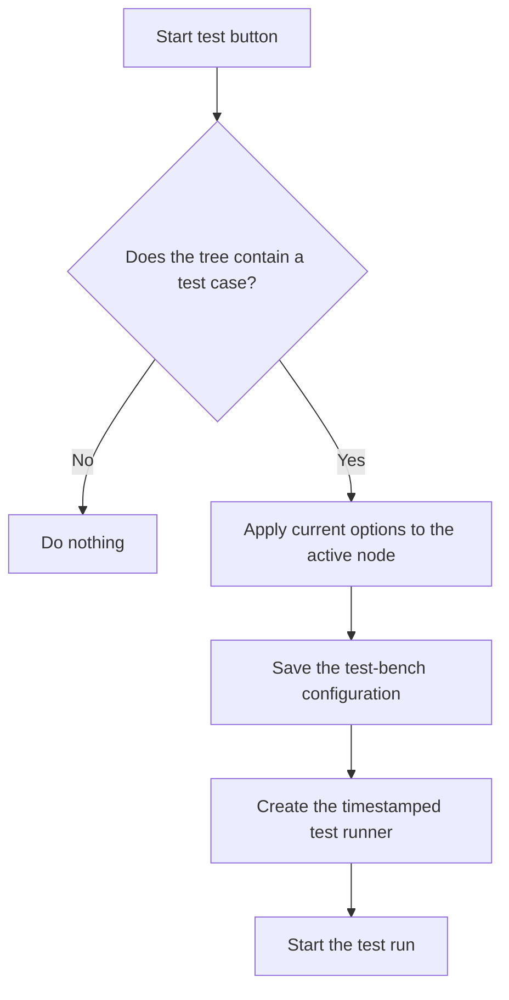

# Start test!

> Analysis status: Reviewed from recovered source and UI evidence.

## Control

| Property | Recovered value |
| --- | --- |
| Component path | `frmTestBenchEditor.pnlMain.pnlTestOptions.btnStartTest` |
| Control class | `TButton` |
| Handler | `btnStartTestClick` at `012c6a50` |

## What happens when clicked

The handler starts only when the test-case tree contains at least one item. It applies the current form options to the active tree node, saves the configuration to its current path or prompts for a name when required, invokes a recovered form helper, and creates and starts the test runner with the saved configuration path and a timestamp identifier. The button also has modal result 1. If the tree is empty, the handler does nothing.

## Click flow

## Evidence

- [Recovered btnStartTestClick source](../../../DecompiledSources/Tina16/functions/00000000012C6A50__FUN_012c6a50.c)
- [Recovered option-copy helper](../../../DecompiledSources/Tina16/functions/00000000012C7AE0__FUN_012c7ae0.c)
- [Recovered XML configuration writer](../../../DecompiledSources/Tina16/functions/00000000012C8AE0__FUN_012c8ae0.c)
- [Recovered test-runner start helper](../../../DecompiledSources/Tina16/functions/00000000012C4640__FUN_012c4640.c)
- The DFM resource supplies the control identity, caption or state, and event binding.
- No extracted glyph is present for this control.

## Analysis limits

- The exact purpose of the intermediate form helper at `00805990` is not recovered. The handler also does not check whether a prompted save was canceled before it continues to the runner call.
