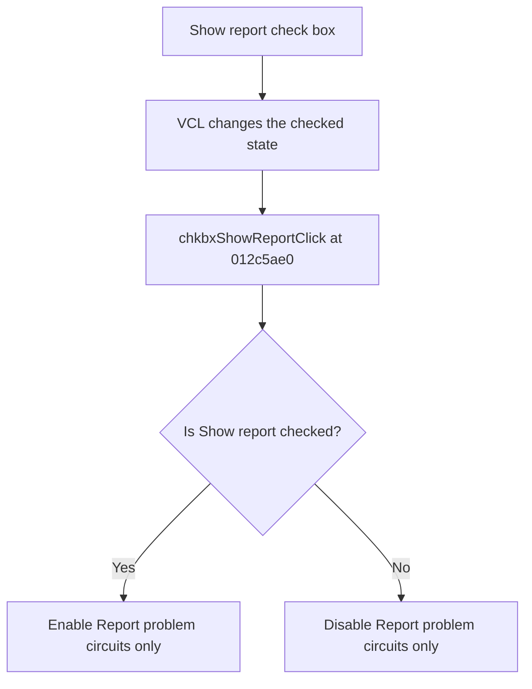

# Show report

> Analysis status: Reviewed from recovered source and UI evidence.

## Control

| Property | Recovered value |
| --- | --- |
| Component path | `frmTestBenchEditor.pnlMain.pnlTestOptions.chkbxShowReport` |
| Control class | `TCheckBox` |
| Handler | `chkbxShowReportClick` at `012c5ae0` |

## What happens when clicked

The VCL check box changes its checked state. The handler copies that state to the enabled state of `Report problem circuits only`. When Show report is cleared, the filter check box becomes disabled. When Show report is selected, the filter check box becomes enabled. The handler does not change the filter check box's checked state.

## Click flow

## Evidence

- [Recovered chkbxShowReportClick source](../../../DecompiledSources/Tina16/functions/00000000012C5AE0__FUN_012c5ae0.c)
- The DFM resource supplies the control identity, caption or state, and event binding.
- No extracted glyph is present for this control.

## Analysis limits

- This immediate click path does not create or display a report; the saved option is consumed by the later test workflow.
