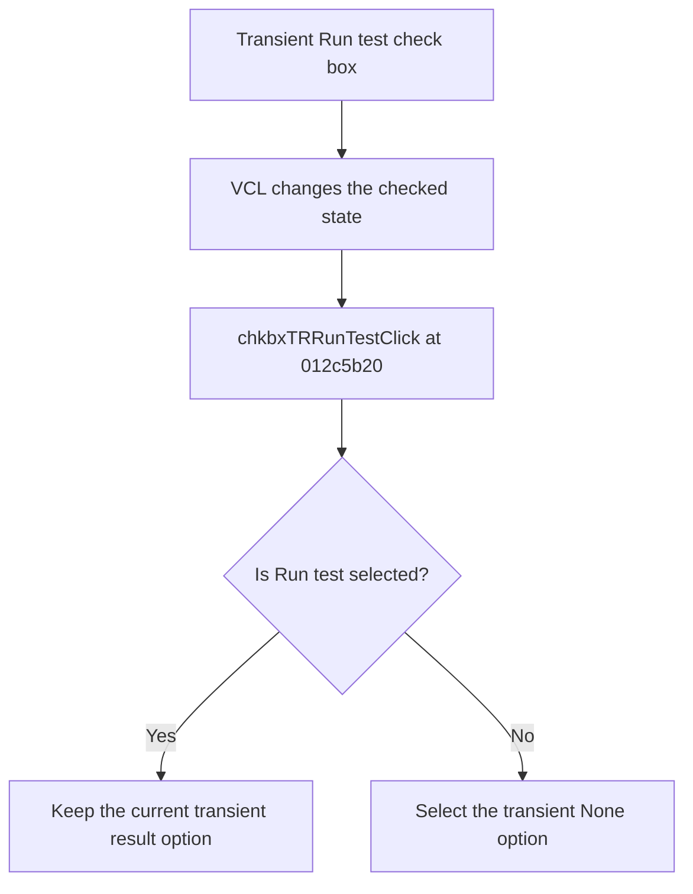

# Run test

> Analysis status: Reviewed from recovered source and UI evidence.

## Control

| Property | Recovered value |
| --- | --- |
| Component path | `frmTestBenchEditor.pnlMain.pnlTestOptions.pctrlMode.tsTR.grbxTR.chkbxTRRunTest` |
| Control class | `TCheckBox` |
| Handler | `chkbxTRRunTestClick` at `012c5b20` |

## What happens when clicked

The VCL check box changes its checked state. When Run test becomes cleared, the handler selects the transient `None` radio button. When Run test becomes selected, the handler makes no additional change. This handler does not start a test.

## Click flow

## Evidence

- [Recovered chkbxTRRunTestClick source](../../../DecompiledSources/Tina16/functions/00000000012C5B20__FUN_012c5b20.c)
- The DFM resource supplies the control identity, caption, initial state, and event binding.
- No extracted glyph is present for this control.

## Analysis limits

- Test execution starts through the separate Start test control, not through this immediate click handler.
