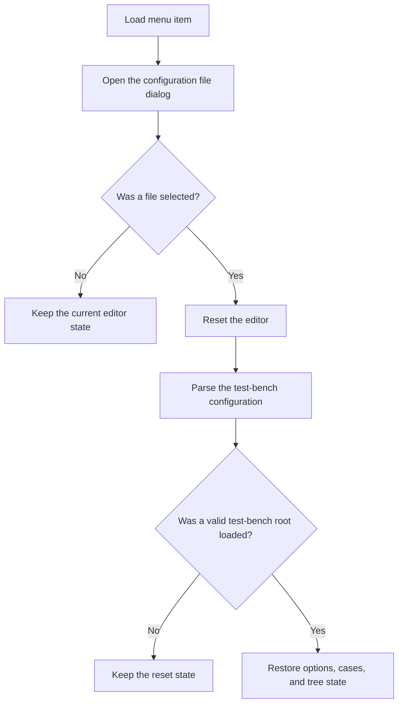

# Load...

> Analysis status: Reviewed from recovered source and UI evidence.

## Control

| Property | Recovered value |
| --- | --- |
| Component path | `frmTestBenchEditor.TestBenchEditorMenu.mnFile.mnLoad` |
| Control class | `TMenuItem` |
| Handler | `mnLoadClick` at `012c4ea0` |

## What happens when clicked

The handler initializes the Open dialog in the user data folder. If the user cancels, it does not change the editor. If the user selects a file, it resets the current editor state and loads the selected test-bench configuration. The loader accepts XML and invokes a legacy-file conversion path when the file does not start with `<?xml`. It restores the circuit and result folders, report and save options, test mode, thread and timeout values, test cases, and per-case settings. It then enables the applicable editor controls. If the selected file cannot produce a valid test-bench root, the reset state remains and no local message is shown.

## Click flow

## Evidence

- [Recovered mnLoadClick source](../../../DecompiledSources/Tina16/functions/00000000012C4EA0__FUN_012c4ea0.c)
- [Recovered test-bench loader](../../../DecompiledSources/Tina16/functions/00000000012C7E70__FUN_012c7e70.c)
- [Recovered editor reset](../../../DecompiledSources/Tina16/functions/00000000012C7130__FUN_012c7130.c)
- The DFM resource supplies the control identity, caption or state, and event binding.
- No extracted glyph is present for this control.

## Analysis limits

- The loader has no local message for a syntactically readable file that does not contain a valid test-bench root.
