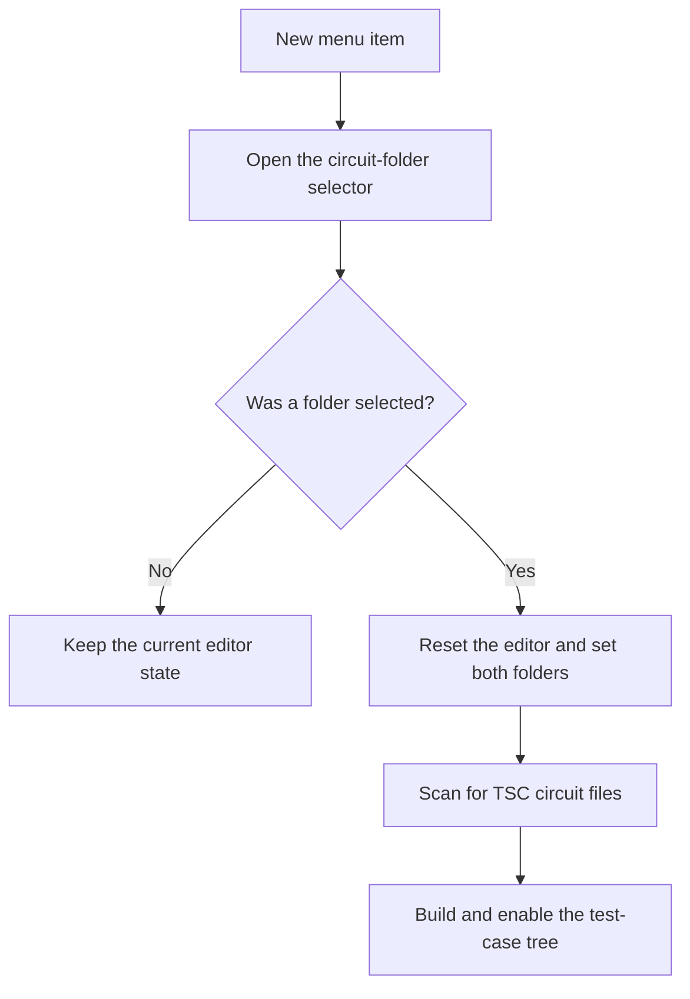

# New

> Analysis status: Reviewed from recovered source and UI evidence.

## Control

| Property | Recovered value |
| --- | --- |
| Component path | `frmTestBenchEditor.TestBenchEditorMenu.mnFile.mnNew` |
| Control class | `TMenuItem` |
| Handler | `mnNewClick` at `012c4cc0` |

## What happens when clicked

The handler opens a folder selector with the current circuit folder. If the user cancels, it makes no change. If the user accepts, it resets the editor, writes the selected folder to both the circuit-folder and result-folder fields, clears the file tree, creates a new root node, and scans for `.TSC` files. The `Recurse subfolders` check box controls recursive scanning. It rebuilds the tree and enables the related folder and test controls.

## Click flow

## Evidence

- [Recovered mnNewClick source](../../../DecompiledSources/Tina16/functions/00000000012C4CC0__FUN_012c4cc0.c)
- [Recovered editor reset](../../../DecompiledSources/Tina16/functions/00000000012C7130__FUN_012c7130.c)
- [Recovered TSC folder scan](../../../DecompiledSources/Tina16/functions/00000000012C7620__FUN_012c7620.c)
- The DFM resource supplies the control identity, caption or state, and event binding.
- No extracted glyph is present for this control.

## Analysis limits

- The folder selector implementation does not expose a separate validation message for an unreadable folder.
