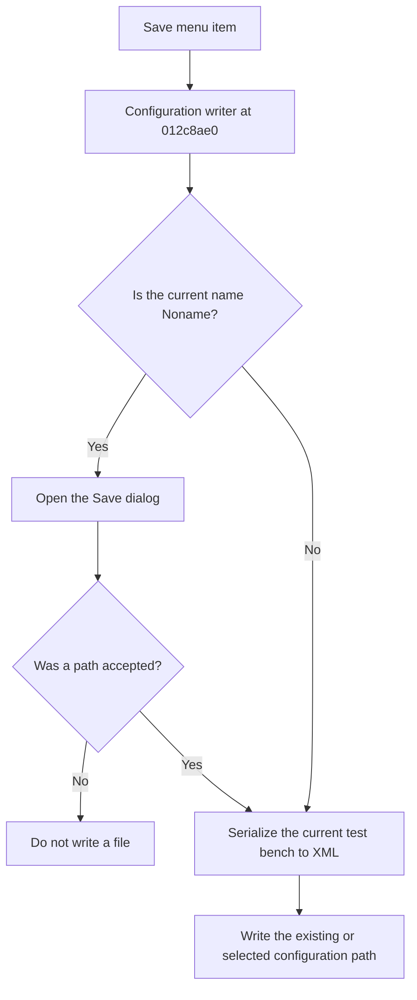

# Save

> Analysis status: Reviewed from recovered source and UI evidence.

## Control

| Property | Recovered value |
| --- | --- |
| Component path | `frmTestBenchEditor.TestBenchEditorMenu.mnFile.mnSave` |
| Control class | `TMenuItem` |
| Handler | `mnSaveClick` at `012c4fa0` |

## What happens when clicked

The handler calls the shared configuration writer without forcing a new name. If the current configuration name is `Noname`, the writer opens the Save dialog. Otherwise, it writes to the existing configuration path. A canceled Save dialog stops the operation. The writer serializes the folders, report and output options, test mode, thread and timeout values, and every circuit test case to XML.

## Click flow

## Evidence

- [Recovered mnSaveClick source](../../../DecompiledSources/Tina16/functions/00000000012C4FA0__FUN_012c4fa0.c)
- [Recovered XML configuration writer](../../../DecompiledSources/Tina16/functions/00000000012C8AE0__FUN_012c8ae0.c)
- The DFM resource supplies the control identity, caption or state, and event binding.
- No extracted glyph is present for this control.

## Analysis limits

- The recovered writer does not show a local catch or retry path for a file-system write failure.
