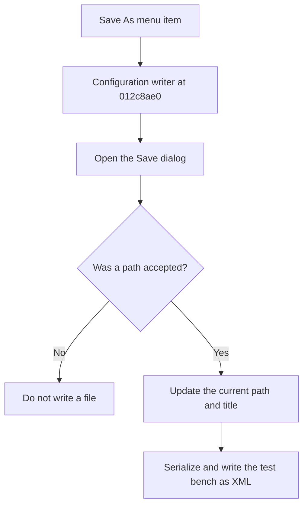

# Save As...

> Analysis status: Reviewed from recovered source and UI evidence.

## Control

| Property | Recovered value |
| --- | --- |
| Component path | `frmTestBenchEditor.TestBenchEditorMenu.mnFile.mnSaveAs` |
| Control class | `TMenuItem` |
| Handler | `mnSaveAsClick` at `012c4fb0` |

## What happens when clicked

The handler calls the shared configuration writer with the force-new-name flag. The writer always opens the Save dialog. If the user cancels, it does not write. If the user accepts, it updates the current path and title and serializes the folders, report and output options, test mode, thread and timeout values, and every circuit test case to XML.

## Click flow

## Evidence

- [Recovered mnSaveAsClick source](../../../DecompiledSources/Tina16/functions/00000000012C4FB0__FUN_012c4fb0.c)
- [Recovered XML configuration writer](../../../DecompiledSources/Tina16/functions/00000000012C8AE0__FUN_012c8ae0.c)
- The DFM resource supplies the control identity, caption or state, and event binding.
- No extracted glyph is present for this control.

## Analysis limits

- The recovered writer does not show a local catch or retry path for a file-system write failure.
