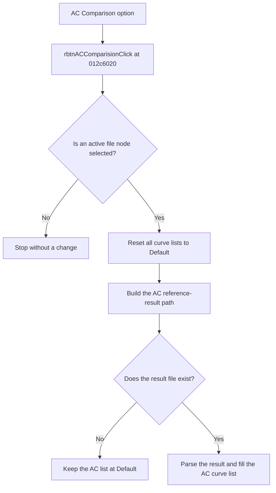

# Comparison

> Analysis status: Reviewed from recovered source and UI evidence.

## Control

| Property | Recovered value |
| --- | --- |
| Component path | `frmTestBenchEditor.pnlMain.pnlTestOptions.pctrlMode.tsAC.grbxAC.rbtnACComparision` |
| Control class | `TRadioButton` |
| Handler | `rbtnACComparisionClick` at `012c6020` |

## What happens when clicked

The handler requires an active file node in the circuit tree. It resets the transient, AC, and DC curve lists to `Default`. It then builds the AC reference-result path for the selected circuit. The path uses the `.corner` part when the AC corner-test option is selected and ends in `.refresult.ac`. If the result exists, the application parses it and fills the AC curve list. If the result is absent, the list stays at `Default` and this click path shows no local error message.

## Click flow

## Evidence

- [Recovered rbtnACComparisionClick source](../../../DecompiledSources/Tina16/functions/00000000012C6020__FUN_012c6020.c)
- [Recovered comparison-list loader](../../../DecompiledSources/Tina16/functions/00000000012CA200__FUN_012ca200.c)
- The DFM resource supplies the control identity, caption, state, and event binding.
- No extracted glyph is present for this control.

## Analysis limits

- The recovered control name uses the spelling `Comparision`; the visible caption is `Comparison`.
