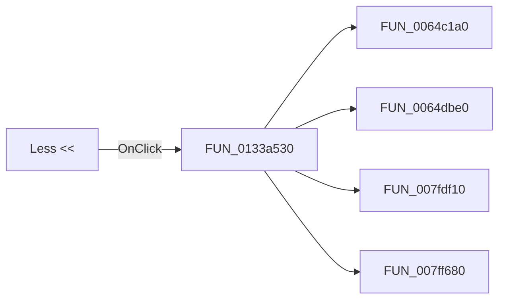

# Less <<

> Analysis status: Pending individual source review.

## Control

| Property | Recovered value |
| --- | --- |
| Form | frmTranConvError |
| Component path | frmTranConvError.btnLess |
| Control class | TButton |
| Caption | Less << |
| Hint | Not present in the recovered resource. |
| Text | Not present in the recovered resource. |
| Handler name | btnLessClick |
| Handler address | 0133a530 |
| Graph node | `resource:dfm:frmTranConvError/frmTranConvError.btnLess` |
| Handler node | `function:0133a530` |
| Graph layer | UI |

## What happens when clicked

Pending individual analysis. An agent must read the recovered handler source and its relevant callees before it replaces this text.

## Click flow

## Handler evidence

- Source: [DecompiledSources/Tina16/functions/000000000133A530__FUN_0133a530.c](../../../DecompiledSources/Tina16/functions/000000000133A530__FUN_0133a530.c)
- Recovered role: Not present in the recovered resource.
- Current graph summary: Handles 1 Delphi UI event: frmTranConvError.btnLess.OnClick.
- Current graph behavior: Not present in the recovered resource.
- Current graph evidence: Not present in the recovered resource.
- Complexity: complex
- Distinct outgoing calls: 4

## Direct calls

- `function:0064c1a0` — FUN_0064c1a0
- `function:0064dbe0` — FUN_0064dbe0
- `function:007fdf10` — FUN_007fdf10
- `function:007ff680` — FUN_007ff680

## Resource evidence

- Kind: Not present in the recovered resource.
- Modal result: Not present in the recovered resource.
- Checked state: Not present in the recovered resource.
- List items: Not present in the recovered resource.
- Image reference: Not present in the recovered resource.
- Extracted glyph: None.

## Nearby label candidates

Nearby labels are layout candidates only. They are not proof of behavior.

- No same-parent label candidate is available.

## Analysis limits

- Do not infer behavior from the control class, caption, hint, glyph, or nearby label alone.
- Do not replace the pending status until the handler source and relevant call path provide enough evidence.
