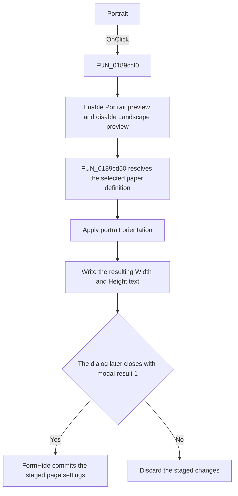

# Portrait

> Analysis status: Source reviewed. The preview and staged-dimension changes
> are supported by the shared handler and page-size helper.

## Control

| Property | Recovered value |
| --- | --- |
| Form | frxPageSettingsForm |
| Component path | frxPageSettingsForm.OrientationL.PortraitRB |
| Control class | TRadioButton |
| Caption | Portrait |
| Hint | Not present in the recovered resource. |
| Text | Not present in the recovered resource. |
| Handler name | PortraitRBClick |
| Handler address | 0189ccf0 |
| Graph node | `resource:dfm:frxPageSettingsForm/frxPageSettingsForm.OrientationL.PortraitRB` |
| Handler node | `function:0189ccf0` |
| Graph layer | UI |

## What happens when clicked

VCL first checks `Portrait` and clears the radio button in the same group. The
shared handler then enables the Portrait preview image and disables the
Landscape preview image.

The handler calls `FUN_0189cd50` to recalculate the staged page dimensions. The
size helper reads the selected paper name and the current Width and Height
edits, resolves the paper definition, and supplies portrait orientation because
`Portrait` is checked. It then writes the paper definition's resulting width
and height back to the edits in the active display units. Whole values are
formatted as integers. Other values use two decimal places.

This click changes only the dialog controls. `FormHide` copies the selected
orientation, paper size, dimensions, and margins to the page object only when
the dialog modal result is `1`. Cancel therefore discards the staged portrait
selection.

## Click flow

## Handler evidence

- Source: [DecompiledSources/Tina16/functions/000000000189CCF0__FUN_0189ccf0.c](../../../DecompiledSources/Tina16/functions/000000000189CCF0__FUN_0189ccf0.c)
- Recovered role: Page-orientation preview and staged-dimension update handler.
- Current graph summary: Handles 2 Delphi UI events: frxPageSettingsForm.OrientationL.PortraitRB.OnClick, frxPageSettingsForm.OrientationL.LandscapeRB.OnClick.
- Current graph behavior: The checked-in graph does not yet contain a curated behavior description for this function.
- Current graph evidence: Both orientation controls trigger this function. It reads both checked states, sets both image enabled states, and calls the recovered Size control handler.
- Complexity: moderate
- Distinct outgoing calls: 2

## Direct calls

- `function:0064dbe0` — [FUN_0064dbe0](../../../DecompiledSources/Tina16/functions/000000000064DBE0__FUN_0064dbe0.c), the VCL enabled-state setter used for both preview images.
- `function:0189cd50` — [FUN_0189cd50](../../../DecompiledSources/Tina16/functions/000000000189CD50__FUN_0189cd50.c), the paper-size and dimension updater.

## Resource evidence

- Kind: Not present in the recovered resource.
- Modal result: Not present in the recovered resource.
- Checked state: true
- List items: Not present in the recovered resource.
- Image reference: Not present in the recovered resource.
- Extracted glyph: None.

The orientation group contains the extracted
[Portrait preview](../../../glyph/0205_frxPageSettingsForm_frxPageSettingsForm_OrientationL_PortraitImg_Picture_Data.png)
and
[Landscape preview](../../../glyph/0206_frxPageSettingsForm_frxPageSettingsForm_OrientationL_LandscapeImg_Picture_Data.png).
Their dimensions are 26 by 32 and 32 by 26 pixels. The handler's enabled-state
writes prove which preview is active.

## Nearby label candidates

Nearby labels are layout candidates only. They are not proof of behavior.

- No same-parent label candidate is available.

## Analysis limits

- The runtime paper-size names are loaded from the shared paper-definition
  object. They are not present as DFM list items.
- The click stages settings in the dialog. It does not modify the report page
  object directly.
