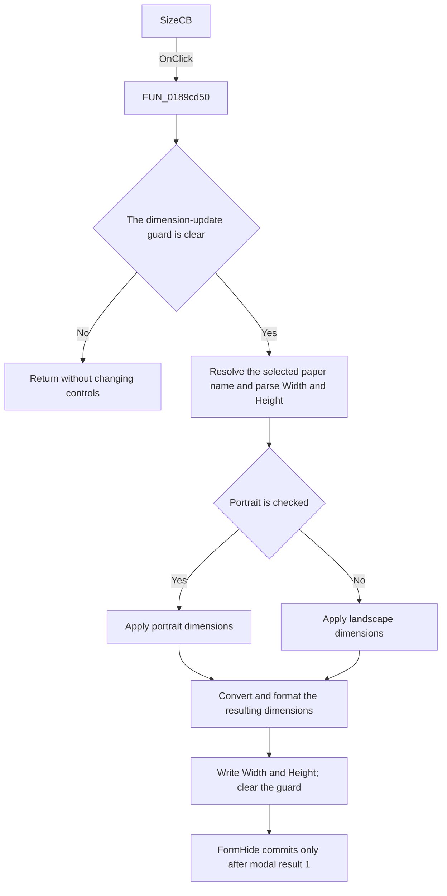

# SizeCB

> Analysis status: Source reviewed. The paper-definition lookup, orientation
> branch, and staged Width and Height updates are supported by the source.

## Control

| Property | Recovered value |
| --- | --- |
| Form | frxPageSettingsForm |
| Component path | frxPageSettingsForm.SizeL.SizeCB |
| Control class | TComboBox |
| Caption | Not present in the recovered resource. |
| Hint | Not present in the recovered resource. |
| Text | Not present in the recovered resource. |
| Handler name | SizeCBClick |
| Handler address | 0189cd50 |
| Graph node | `resource:dfm:frxPageSettingsForm/frxPageSettingsForm.SizeL.SizeCB` |
| Handler node | `function:0189cd50` |
| Graph layer | UI |

## What happens when clicked

The click recalculates the staged Width and Height values from the selected
paper definition. The combo-box rows are loaded at form show from the shared
paper-definition object; they are not stored in the DFM.

The handler first checks its reentry guard at form offset `+0x7E1`. If the
guard is already set, it returns without changing the controls. Otherwise, it
sets the guard and performs these operations:

1. Read the selected Size text and resolve its paper code. A failed name
   lookup falls back to the first paper-definition row.
2. Parse the current Width and Height edit text and convert the values from the
   active display unit to the internal millimetre values.
3. Read the `Portrait` checked state. A clear state supplies landscape
   orientation to the paper-definition method.
4. For paper code `0x100`, use the recovered custom-size argument order. For a
   standard paper code, use the normal Width and Height order.
5. Read the resulting width and height from the paper definition, convert them
   back to the active display unit, and write both edits. Whole values are
   formatted as integers. Other values use two decimal places.
6. Clear the reentry guard.

Writing either dimension normally changes the combo selection to the custom
row through `WidthEChange`. The guard prevents the handler's own Width and
Height writes from causing that reset.

The click stages values only in the dialog. `FormHide` writes the selected
paper code, orientation, dimensions, and margins to the page object only after
modal result `1`. Cancel discards the staged size selection. Numeric conversion
errors are not caught in this handler.

## Click flow

## Handler evidence

- Source: [DecompiledSources/Tina16/functions/000000000189CD50__FUN_0189cd50.c](../../../DecompiledSources/Tina16/functions/000000000189CD50__FUN_0189cd50.c)
- Recovered role: Staged paper-size and page-dimension update handler.
- Current graph summary: Handles 1 Delphi UI event: frxPageSettingsForm.SizeL.SizeCB.OnClick.
- Current graph behavior: The checked-in graph does not yet contain a curated behavior description for this function.
- Current graph evidence: The Size control triggers this function, and the orientation handler calls it after either radio-button click. Its call tree resolves paper definitions, parses and converts dimensions, and writes both dimension edits under a reentry guard.
- Complexity: complex
- Distinct outgoing calls: 10

## Direct calls

- `function:00414560` — Delphi UnicodeString array finalization helper
- `function:0064dd90` — VCL control Unicode text reader
- `function:0064de00` — VCL control text setter with change suppression
- `function:0180d800` — FUN_0180d800
- `function:0180d940` — FUN_0180d940
- `function:0188b960` — FUN_0188b960
- `function:0188d190` — FUN_0188d190
- `function:0188d920` — FUN_0188d920
- `function:0189bbd0` — FUN_0189bbd0
- `function:0189bc30` — FUN_0189bc30

The application-relevant calls are:

- [FUN_0188b960](../../../DecompiledSources/Tina16/functions/000000000188B960__FUN_0188b960.c)
  resolves the paper definition from the selected Size text and falls back to
  the first row when the name is not found.
- [FUN_0180d800](../../../DecompiledSources/Tina16/functions/000000000180D800__FUN_0180d800.c)
  normalizes the decimal separator and parses each dimension.
- [FUN_0189bc30](../../../DecompiledSources/Tina16/functions/000000000189BC30__FUN_0189bc30.c)
  converts a displayed centimetre or inch value to internal millimetres.
- [FUN_0189bbd0](../../../DecompiledSources/Tina16/functions/000000000189BBD0__FUN_0189bbd0.c)
  converts an internal millimetre value to the active display unit.
- [FUN_0180d940](../../../DecompiledSources/Tina16/functions/000000000180D940__FUN_0180d940.c)
  formats an integral value without decimals or another value with two decimal
  places.

## Resource evidence

- Kind: Not present in the recovered resource.
- Modal result: Not present in the recovered resource.
- Checked state: Not present in the recovered resource.
- List items: Not present in the recovered resource.
- Image reference: Not present in the recovered resource.
- Extracted glyph: None.

`FormShow` assigns the combo-box rows from the runtime paper-definition list
and selects the row that matches the current page paper code. If the code is
not present, it selects the custom paper code `0x100`.

## Nearby label candidates

Nearby labels are layout candidates only. They are not proof of behavior.

- Rank 1: Width at distance 30.
- Rank 2: Height at distance 54.
- Rank 3: cm at distance 134.

## Analysis limits

- The DFM does not contain the runtime paper-size names or their numeric
  dimensions. This article does not invent that list.
- The recovered method that applies a paper definition is virtual. The caller
  proves its paper code, width, height, and orientation inputs and reads its
  resulting dimensions, but its Delphi method name is unknown.
- The combo click stages values in the dialog. It does not modify the report
  page object directly.
