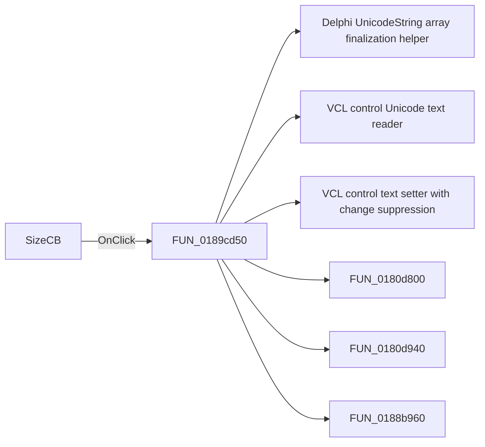

# SizeCB

> Analysis status: Pending individual source review.

## Control

| Property | Recovered value |
| --- | --- |
| Form | frxPageSettingsForm |
| Component path | frxPageSettingsForm.SizeL.SizeCB |
| Control class | TComboBox |
| Caption | Not present in the recovered resource. |
| Hint | Not present in the recovered resource. |
| Text | Not present in the recovered resource. |
| Handler name | SizeCBClick |
| Handler address | 0189cd50 |
| Graph node | `resource:dfm:frxPageSettingsForm/frxPageSettingsForm.SizeL.SizeCB` |
| Handler node | `function:0189cd50` |
| Graph layer | UI |

## What happens when clicked

Pending individual analysis. An agent must read the recovered handler source and its relevant callees before it replaces this text.

## Click flow

## Handler evidence

- Source: [DecompiledSources/Tina16/functions/000000000189CD50__FUN_0189cd50.c](../../../DecompiledSources/Tina16/functions/000000000189CD50__FUN_0189cd50.c)
- Recovered role: Not present in the recovered resource.
- Current graph summary: Handles 1 Delphi UI event: frxPageSettingsForm.SizeL.SizeCB.OnClick.
- Current graph behavior: Not present in the recovered resource.
- Current graph evidence: Not present in the recovered resource.
- Complexity: complex
- Distinct outgoing calls: 10

## Direct calls

- `function:00414560` — Delphi UnicodeString array finalization helper
- `function:0064dd90` — VCL control Unicode text reader
- `function:0064de00` — VCL control text setter with change suppression
- `function:0180d800` — FUN_0180d800
- `function:0180d940` — FUN_0180d940
- `function:0188b960` — FUN_0188b960
- `function:0188d190` — FUN_0188d190
- `function:0188d920` — FUN_0188d920
- `function:0189bbd0` — FUN_0189bbd0
- `function:0189bc30` — FUN_0189bc30

## Resource evidence

- Kind: Not present in the recovered resource.
- Modal result: Not present in the recovered resource.
- Checked state: Not present in the recovered resource.
- List items: Not present in the recovered resource.
- Image reference: Not present in the recovered resource.
- Extracted glyph: None.

## Nearby label candidates

Nearby labels are layout candidates only. They are not proof of behavior.

- Rank 1: Width at distance 30.
- Rank 2: Height at distance 54.
- Rank 3: cm at distance 134.

## Analysis limits

- Do not infer behavior from the control class, caption, hint, glyph, or nearby label alone.
- Do not replace the pending status until the handler source and relevant call path provide enough evidence.
