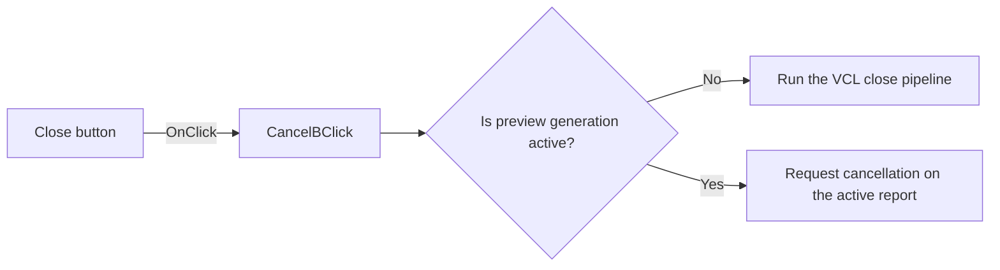

# Close

> Analysis status: Reviewed from recovered source and graph evidence.

## Control

| Property | Recovered value |
| --- | --- |
| Form | frxPreviewForm |
| Component path | frxPreviewForm.ToolBar.CancelB |
| Control class | TSpeedButton |
| Caption | Close |
| Hint | Not present in the recovered resource. |
| Text | Not present in the recovered resource. |
| Handler name | CancelBClick |
| Handler address | 018afcb0 |
| Graph node | `resource:dfm:frxPreviewForm/frxPreviewForm.ToolBar.CancelB` |
| Handler node | `function:018afcb0` |
| Graph layer | UI |

## What happens when clicked

The click has two paths. When the preview busy flag at `+0x531` is clear, the handler calls the VCL form close pipeline. A modal form receives `mrCancel`; a modeless form uses its close query and close action. When the busy flag is set, the handler does not close the form. It requests cancellation on the active FastReport report object through `FUN_018ac910` and `FUN_01977630`.

## Click flow

## Handler evidence

- Source: [DecompiledSources/Tina16/functions/00000000018AFCB0__FUN_018afcb0.c](../../../DecompiledSources/Tina16/functions/00000000018AFCB0__FUN_018afcb0.c)
- Recovered role: Closes an idle preview or cancels active FastReport generation.
- Current graph summary: Handles 1 Delphi UI event: frxPreviewForm.ToolBar.CancelB.OnClick.
- Current graph behavior: Branches on the preview busy flag. It closes the form when idle and requests report cancellation when busy.
- Current graph evidence: `FUN_018afcb0` tests byte `preview+0x531`. The clear branch calls annotated VCL `TCustomForm.Close` helper `FUN_00805200`. The set branch calls `FUN_018ac910`, which reaches the active report through VMT slot `+0x268` and passes one to `FUN_01977630`.
- Complexity: moderate
- Distinct outgoing calls: 2

## Direct calls

- `function:00805200` — FUN_00805200
- `function:018ac910` — FUN_018ac910

## Resource evidence

- Kind: Not present in the recovered resource.
- Modal result: Not present in the recovered resource.
- Checked state: Not present in the recovered resource.
- List items: Not present in the recovered resource.
- Image reference: Not present in the recovered resource.
- Extracted glyph: None.

## Nearby label candidates

Nearby labels are layout candidates only. They are not proof of behavior.

- No same-parent label candidate is available.

## Analysis limits

- The report cancellation helper has no local confirmation or error branch.
- The VCL close pipeline can reject modeless closure through the form close query.
