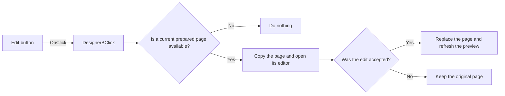

# Edit

> Analysis status: Reviewed from recovered source and graph evidence.

## Control

| Property | Recovered value |
| --- | --- |
| Form | frxPreviewForm |
| Component path | frxPreviewForm.ToolBar.DesignerB |
| Control class | TToolButton |
| Caption | Edit |
| Hint | Not present in the recovered resource. |
| Text | Not present in the recovered resource. |
| Handler name | DesignerBClick |
| Handler address | 018afbb0 |
| Graph node | `resource:dfm:frxPreviewForm/frxPreviewForm.ToolBar.DesignerB` |
| Handler node | `function:018afbb0` |
| Graph layer | UI |

## What happens when clicked

The handler asks the FastReport preview to edit the current prepared page. The callee gets the page for the current one-based page number. A missing page causes a no-op. For an available page, it selects one of two editor classes from the page type, copies the page into a temporary report container, and opens the editor. Only an accepted editor result replaces the current prepared page and refreshes the preview. Cancel leaves the original page in place. The temporary report container is destroyed on both paths.

## Click flow

## Handler evidence

- Source: [DecompiledSources/Tina16/functions/00000000018AFBB0__FUN_018afbb0.c](../../../DecompiledSources/Tina16/functions/00000000018AFBB0__FUN_018afbb0.c)
- Recovered role: Opens an editor for the current prepared page and applies accepted changes.
- Current graph summary: Handles 1 Delphi UI event: frxPreviewForm.ToolBar.DesignerB.OnClick.
- Current graph behavior: Copies the current page to a temporary editor context. An accepted result replaces that page and refreshes the preview; a missing page or canceled edit does not change it.
- Current graph evidence: `FUN_018afbb0` passes preview field `+0x848` to `FUN_018aae70`. That callee gets page `currentPage-1`, branches on the page class, creates an editor object and temporary report, calls the editor, tests `FUN_01976e80`, and only on a nonzero result replaces the current page and signals a changed preview.
- Complexity: simple
- Distinct outgoing calls: 1

## Direct calls

- `function:018aae70` — FUN_018aae70

## Resource evidence

- Kind: Not present in the recovered resource.
- Modal result: Not present in the recovered resource.
- Checked state: Not present in the recovered resource.
- List items: Not present in the recovered resource.
- Image reference: Not present in the recovered resource.
- Extracted glyph: None.

## Nearby label candidates

Nearby labels are layout candidates only. They are not proof of behavior.

- No same-parent label candidate is available.

## Analysis limits

- The recovered source does not expose the two editor class names.
- The handler has no local exception, retry, or rollback block.
