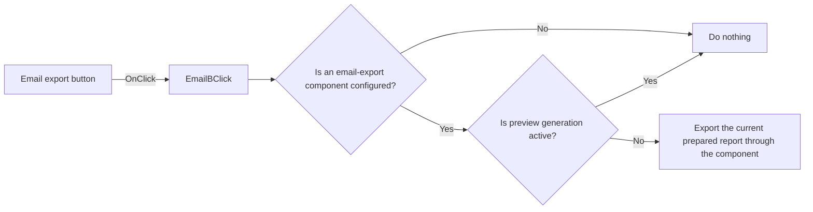

# EmailB

> Analysis status: Reviewed from recovered source and graph evidence.

## Control

| Property | Recovered value |
| --- | --- |
| Form | frxPreviewForm |
| Component path | frxPreviewForm.ToolBar.EmailB |
| Control class | TToolButton |
| Caption | EmailB |
| Hint | Not present in the recovered resource. |
| Text | Not present in the recovered resource. |
| Handler name | EmailBClick |
| Handler address | 018b0070 |
| Graph node | `resource:dfm:frxPreviewForm/frxPreviewForm.ToolBar.EmailB` |
| Handler node | `function:018b0070` |
| Graph layer | UI |

## What happens when clicked

The handler checks the configured email-export component at form field `+0x860`. A null component causes a no-op. When the component is available, the handler passes it to the common FastReport export routine. That routine also does nothing while preview generation is active. Otherwise, it selects the current page, exports through the supplied component, and refreshes the preview state.

## Click flow

## Handler evidence

- Source: [DecompiledSources/Tina16/functions/00000000018B0070__FUN_018b0070.c](../../../DecompiledSources/Tina16/functions/00000000018B0070__FUN_018b0070.c)
- Recovered role: Starts email export through the configured FastReport export component.
- Current graph summary: Handles 1 Delphi UI event: frxPreviewForm.ToolBar.EmailB.OnClick.
- Current graph behavior: Uses the configured email-export component only when it exists and the preview is idle; otherwise it returns without output.
- Current graph evidence: `FUN_018b0070` tests form field `+0x860` and passes the nonzero object to `FUN_018aa5e0`. The common routine tests busy byte `preview+0x531`, selects the current page, invokes the prepared-report export method with the supplied component, and signals a preview update.
- Complexity: simple
- Distinct outgoing calls: 1

## Direct calls

- `function:018aa5e0` — FUN_018aa5e0

## Resource evidence

- Kind: Not present in the recovered resource.
- Modal result: Not present in the recovered resource.
- Checked state: Not present in the recovered resource.
- List items: Not present in the recovered resource.
- Image reference: Not present in the recovered resource.
- Extracted glyph: None.

## Nearby label candidates

Nearby labels are layout candidates only. They are not proof of behavior.

- No same-parent label candidate is available.

## Analysis limits

- The DFM marks the button as initially hidden, and the recovered handler does not show how the export component is configured.
- The handler has no local error, retry, or success-confirmation path.
