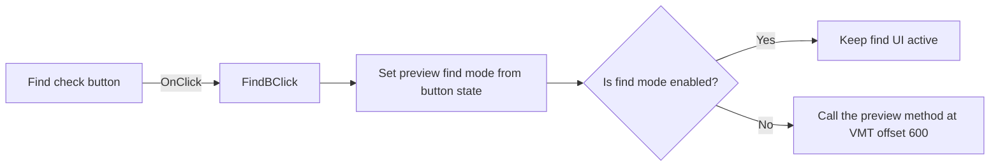

# Find

> Analysis status: Reviewed from recovered source and graph evidence.

## Control

| Property | Recovered value |
| --- | --- |
| Form | frxPreviewForm |
| Component path | frxPreviewForm.ToolBar.FindB |
| Control class | TToolButton |
| Caption | Find |
| Hint | Not present in the recovered resource. |
| Text | Not present in the recovered resource. |
| Handler name | FindBClick |
| Handler address | 018af1c0 |
| Graph node | `resource:dfm:frxPreviewForm/frxPreviewForm.ToolBar.FindB` |
| Handler node | `function:018af1c0` |
| Graph layer | UI |

## What happens when clicked

The check button controls the preview find mode. The handler reads the button state at `+0x31a` and passes it to `FUN_018a9960`. That routine updates the preview find state, synchronizes the find UI and callbacks, and refreshes the preview only when the state changes. When the resulting find state is off, the handler calls a preview virtual method at offset `+600`; the recovered graph does not identify that method name.

## Click flow

## Handler evidence

- Source: [DecompiledSources/Tina16/functions/00000000018AF1C0__FUN_018af1c0.c](../../../DecompiledSources/Tina16/functions/00000000018AF1C0__FUN_018af1c0.c)
- Recovered role: Synchronizes the FastReport preview find mode with the Find check button.
- Current graph summary: Handles 1 Delphi UI event: frxPreviewForm.ToolBar.FindB.OnClick.
- Current graph behavior: Applies the button state to the preview find mode and invokes one additional preview method when find mode is off.
- Current graph evidence: `FUN_018af1c0` reads byte `+0x31a` from form field `+0x6f8`, calls `FUN_018a9960`, tests the result through `FUN_018a9930`, and calls VMT offset `600` only for a false result. `FUN_018a9960` updates the find-state fields, child controls, callbacks, and repaint path.
- Complexity: moderate
- Distinct outgoing calls: 2

## Direct calls

- `function:018a9930` — FUN_018a9930
- `function:018a9960` — FUN_018a9960

## Resource evidence

- Kind: Not present in the recovered resource.
- Modal result: Not present in the recovered resource.
- Checked state: Not present in the recovered resource.
- List items: Not present in the recovered resource.
- Image reference: Not present in the recovered resource.
- Extracted glyph: None.

## Nearby label candidates

Nearby labels are layout candidates only. They are not proof of behavior.

- No same-parent label candidate is available.

## Analysis limits

- The recovered source does not identify the virtual method at offset `600`.
- The state setter has no local error or rollback path.
