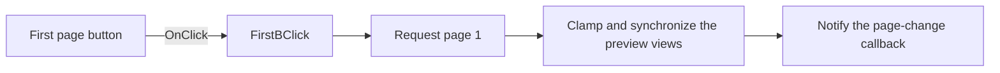

# First

> Analysis status: Reviewed from recovered source and graph evidence.

## Control

| Property | Recovered value |
| --- | --- |
| Form | frxPreviewForm |
| Component path | frxPreviewForm.ToolBar.FirstB |
| Control class | TToolButton |
| Caption | First |
| Hint | Not present in the recovered resource. |
| Text | Not present in the recovered resource. |
| Handler name | FirstBClick |
| Handler address | 018afae0 |
| Graph node | `resource:dfm:frxPreviewForm/frxPreviewForm.ToolBar.FirstB` |
| Handler node | `function:018afae0` |
| Graph layer | UI |

## What happens when clicked

The handler requests page 1. The shared page-selection routine clamps the target to the available one-based page range, updates the current page in the main and thumbnail views, adjusts their scroll positions, invokes the page-change callback, and ends the guarded update. If the report has no pages, the lower-level preview update does not establish a new visible page.

## Click flow

## Handler evidence

- Source: [DecompiledSources/Tina16/functions/00000000018AFAE0__FUN_018afae0.c](../../../DecompiledSources/Tina16/functions/00000000018AFAE0__FUN_018afae0.c)
- Recovered role: Selects the first page in the FastReport preview.
- Current graph summary: Handles 1 Delphi UI event: frxPreviewForm.ToolBar.FirstB.OnClick.
- Current graph behavior: Requests page 1 and synchronizes the main preview, thumbnail view, scrolling, and page-change callback.
- Current graph evidence: `FUN_018afae0` calls `FUN_018a9e90`, which calls `FUN_018a9020` with one. `FUN_018a9020` clamps the page number, writes it through `FUN_018a9880`, updates both preview controls, invokes `FUN_018a9b10`, and brackets the work with update guards.
- Complexity: simple
- Distinct outgoing calls: 1

## Direct calls

- `function:018a9e90` — FUN_018a9e90

## Resource evidence

- Kind: Not present in the recovered resource.
- Modal result: Not present in the recovered resource.
- Checked state: Not present in the recovered resource.
- List items: Not present in the recovered resource.
- Image reference: Not present in the recovered resource.
- Extracted glyph: None.

## Nearby label candidates

Nearby labels are layout candidates only. They are not proof of behavior.

- No same-parent label candidate is available.

## Analysis limits

- The handler does not show an error message when no report page is available.
- The page-selection routine has no local retry or rollback path.
