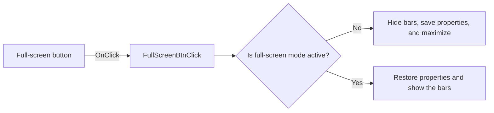

# F

> Analysis status: Reviewed from recovered source and graph evidence.

## Control

| Property | Recovered value |
| --- | --- |
| Form | frxPreviewForm |
| Component path | frxPreviewForm.ToolBar.FullScreenBtn |
| Control class | TToolButton |
| Caption | F |
| Hint | Not present in the recovered resource. |
| Text | Not present in the recovered resource. |
| Handler name | FullScreenBtnClick |
| Handler address | 018b0030 |
| Graph node | `resource:dfm:frxPreviewForm/frxPreviewForm.ToolBar.FullScreenBtn` |
| Handler node | `function:018b0030` |
| Graph layer | UI |

## What happens when clicked

The handler toggles the preview form's full-screen state. On entry, `FUN_018aff80` hides two form-owned bars, saves two current form-property bytes, applies full-screen window properties, maximizes the form, and sets the full-screen flag at `+0x852`. On exit, it restores the saved properties, clears the flag, and shows both bars again.

## Click flow

## Handler evidence

- Source: [DecompiledSources/Tina16/functions/00000000018B0030__FUN_018b0030.c](../../../DecompiledSources/Tina16/functions/00000000018B0030__FUN_018b0030.c)
- Recovered role: Toggles the FastReport preview form between normal and full-screen display.
- Current graph summary: Handles 1 Delphi UI event: frxPreviewForm.ToolBar.FullScreenBtn.OnClick.
- Current graph behavior: Saves normal form properties and hides two bars when full-screen starts; restores them when full-screen ends.
- Current graph evidence: `FUN_018b0030` calls `FUN_018aff80`. That routine branches on form byte `+0x852`, changes visibility for controls at `+0x760` and `+0x6d8`, stores or restores bytes `+0x4d1` and `+0x4d2`, applies form-property setters, and toggles the full-screen byte.
- Complexity: simple
- Distinct outgoing calls: 1

## Direct calls

- `function:018aff80` — FUN_018aff80

## Resource evidence

- Kind: Not present in the recovered resource.
- Modal result: Not present in the recovered resource.
- Checked state: Not present in the recovered resource.
- List items: Not present in the recovered resource.
- Image reference: Not present in the recovered resource.
- Extracted glyph: None.

## Nearby label candidates

Nearby labels are layout candidates only. They are not proof of behavior.

- No same-parent label candidate is available.

## Analysis limits

- The two hidden control fields are consistent with form-owned preview bars, but their recovered field names are not available.
- The handler has no local error or recovery branch.
