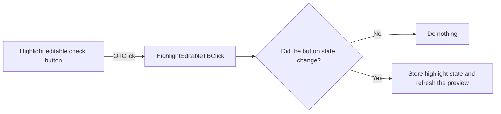

# HighlightEditableTB

> Analysis status: Reviewed from recovered source and graph evidence.

## Control

| Property | Recovered value |
| --- | --- |
| Form | frxPreviewForm |
| Component path | frxPreviewForm.ToolBar.HighlightEditableTB |
| Control class | TToolButton |
| Caption | HighlightEditableTB |
| Hint | Not present in the recovered resource. |
| Text | Not present in the recovered resource. |
| Handler name | HighlightEditableTBClick |
| Handler address | 018af2b0 |
| Graph node | `resource:dfm:frxPreviewForm/frxPreviewForm.ToolBar.HighlightEditableTB` |
| Handler node | `function:018af2b0` |
| Graph layer | UI |

## What happens when clicked

The check button controls highlighting for editable objects in the prepared-page view. The handler reads the button state at `+0x31a` and passes it to `FUN_018a9900`. The setter writes that state to preview field `+0x551` only when it differs from the current value, then invokes the preview refresh method. Repeating the current state is a no-op.

## Click flow

## Handler evidence

- Source: [DecompiledSources/Tina16/functions/00000000018AF2B0__FUN_018af2b0.c](../../../DecompiledSources/Tina16/functions/00000000018AF2B0__FUN_018af2b0.c)
- Recovered role: Toggles highlighting of editable objects in the FastReport preview.
- Current graph summary: Handles 1 Delphi UI event: frxPreviewForm.ToolBar.HighlightEditableTB.OnClick.
- Current graph behavior: Copies the check-button state to the preview highlight flag and refreshes only when the value changes.
- Current graph evidence: `FUN_018af2b0` reads byte `+0x31a` from form field `+0x808` and calls `FUN_018a9900`. That callee compares preview field `+0x551`, writes the new byte, and invokes VMT slot `+0x188` only for a changed state.
- Complexity: simple
- Distinct outgoing calls: 1

## Direct calls

- `function:018a9900` — FUN_018a9900

## Resource evidence

- Kind: Not present in the recovered resource.
- Modal result: Not present in the recovered resource.
- Checked state: Not present in the recovered resource.
- List items: Not present in the recovered resource.
- Image reference: Not present in the recovered resource.
- Extracted glyph: None.

## Nearby label candidates

Nearby labels are layout candidates only. They are not proof of behavior.

- No same-parent label candidate is available.

## Analysis limits

- The source proves the highlight flag and repaint path, but it does not identify the highlight color.
- The handler has no local error path.
