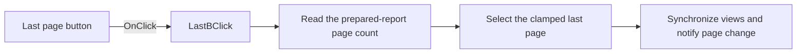

# Last

> Analysis status: Reviewed from recovered source and graph evidence.

## Control

| Property | Recovered value |
| --- | --- |
| Form | frxPreviewForm |
| Component path | frxPreviewForm.ToolBar.LastB |
| Control class | TToolButton |
| Caption | Last |
| Hint | Not present in the recovered resource. |
| Text | Not present in the recovered resource. |
| Handler name | LastBClick |
| Handler address | 018afb40 |
| Graph node | `resource:dfm:frxPreviewForm/frxPreviewForm.ToolBar.LastB` |
| Handler node | `function:018afb40` |
| Graph layer | UI |

## What happens when clicked

The handler gets the prepared-report page count and requests that page number. The shared page-selection routine clamps the target to the available one-based range, updates the current page in the main and thumbnail views, adjusts their scroll positions, invokes the page-change callback, and ends the guarded update. If the report has no pages, the lower-level preview update does not establish a new visible page.

## Click flow

## Handler evidence

- Source: [DecompiledSources/Tina16/functions/00000000018AFB40__FUN_018afb40.c](../../../DecompiledSources/Tina16/functions/00000000018AFB40__FUN_018afb40.c)
- Recovered role: Selects the last page in the FastReport preview.
- Current graph summary: Handles 1 Delphi UI event: frxPreviewForm.ToolBar.LastB.OnClick.
- Current graph behavior: Uses the page count as the requested page and synchronizes the main preview, thumbnail view, scrolling, and page-change callback.
- Current graph evidence: `FUN_018afb40` calls `FUN_018a9ef0`. That callee gets the page count through `FUN_018a9b40` and passes it to `FUN_018a9020`, which clamps and applies the page selection to both preview controls.
- Complexity: simple
- Distinct outgoing calls: 1

## Direct calls

- `function:018a9ef0` — FUN_018a9ef0

## Resource evidence

- Kind: Not present in the recovered resource.
- Modal result: Not present in the recovered resource.
- Checked state: Not present in the recovered resource.
- List items: Not present in the recovered resource.
- Image reference: Not present in the recovered resource.
- Extracted glyph: None.

## Nearby label candidates

Nearby labels are layout candidates only. They are not proof of behavior.

- No same-parent label candidate is available.

## Analysis limits

- The handler does not show an error message when no report page is available.
- The page-selection routine has no local retry or rollback path.
