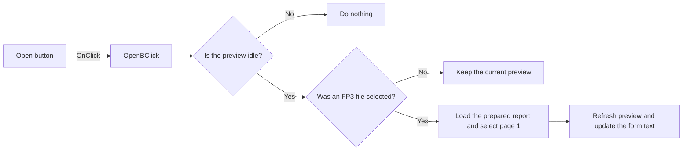

# Open

> Analysis status: Reviewed from recovered source and graph evidence.

## Control

| Property | Recovered value |
| --- | --- |
| Form | frxPreviewForm |
| Component path | frxPreviewForm.ToolBar.OpenB |
| Control class | TToolButton |
| Caption | Open |
| Hint | Not present in the recovered resource. |
| Text | Not present in the recovered resource. |
| Handler name | OpenBClick |
| Handler address | 018af0f0 |
| Graph node | `resource:dfm:frxPreviewForm/frxPreviewForm.ToolBar.OpenB` |
| Handler node | `function:018af0f0` |
| Graph layer | UI |

## What happens when clicked

When the preview is idle, the handler opens a file dialog for FastReport prepared-report files (`*.fp3`). Cancel leaves the preview unchanged. After a selection, the load path clears the current preview, shows the localized loading state, loads the selected prepared report, selects page 1, refreshes the preview, and ends the update. The click handler then updates the form text from the loaded report title, or uses a localized fallback when no title is available. A click while generation is active is a no-op.

## Click flow

## Handler evidence

- Source: [DecompiledSources/Tina16/functions/00000000018AF0F0__FUN_018af0f0.c](../../../DecompiledSources/Tina16/functions/00000000018AF0F0__FUN_018af0f0.c)
- Recovered role: Opens a FastReport FP3 prepared-report file in the preview.
- Current graph summary: Handles 1 Delphi UI event: frxPreviewForm.ToolBar.OpenB.OnClick.
- Current graph behavior: Opens an `*.fp3` picker while idle, loads an accepted file, selects page 1, refreshes the preview, and updates the form text from report metadata or a localized fallback.
- Current graph evidence: `FUN_018af0f0` calls `FUN_018aa2d0`. That callee checks busy byte `+0x531`, creates an open dialog with filter ` (*.fp3)|*.fp3`, and only on an accepted result calls `FUN_018aa470`. The load helper clears the view, loads the selected path through the prepared-report virtual method, selects page 1, and refreshes. The handler then reads a report string at nested offset `+0x240/+0x38` and calls the VCL text setter.
- Complexity: complex
- Distinct outgoing calls: 5

## Direct calls

- `function:00414480` — Delphi UnicodeString clear and finalization helper
- `function:0064de00` — VCL control text setter with change suppression
- `function:0180bfe0` — FUN_0180bfe0
- `function:018aa2d0` — FUN_018aa2d0
- `function:018af290` — FUN_018af290

## Resource evidence

- Kind: Not present in the recovered resource.
- Modal result: Not present in the recovered resource.
- Checked state: Not present in the recovered resource.
- List items: Not present in the recovered resource.
- Image reference: Not present in the recovered resource.
- Extracted glyph: None.

## Nearby label candidates

Nearby labels are layout candidates only. They are not proof of behavior.

- No same-parent label candidate is available.

## Analysis limits

- The recovered source has no local exception, retry, or rollback block for a failed file load.
- The exact localized fallback form text is not recovered.
