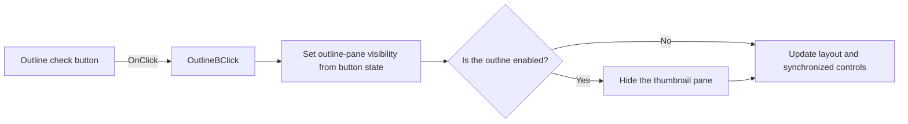

# OutlineB

> Analysis status: Reviewed from recovered source and graph evidence.

## Control

| Property | Recovered value |
| --- | --- |
| Form | frxPreviewForm |
| Component path | frxPreviewForm.ToolBar.OutlineB |
| Control class | TToolButton |
| Caption | Not present in the recovered resource. |
| Hint | Not present in the recovered resource. |
| Text | Not present in the recovered resource. |
| Handler name | OutlineBClick |
| Handler address | 018b01e0 |
| Graph node | `resource:dfm:frxPreviewForm/frxPreviewForm.ToolBar.OutlineB` |
| Handler node | `function:018b01e0` |
| Graph layer | UI |

## What happens when clicked

The check button controls the outline pane. The handler passes the button state to `FUN_018a8dc0`. The setter shows or hides the outline control, updates the related pane, runs the preview layout callback, and synchronizes the button state. Turning the outline on hides the thumbnail pane. A state change refreshes the preview; a repeated state avoids that final refresh.

## Click flow

## Handler evidence

- Source: [DecompiledSources/Tina16/functions/00000000018B01E0__FUN_018b01e0.c](../../../DecompiledSources/Tina16/functions/00000000018B01E0__FUN_018b01e0.c)
- Recovered role: Toggles the FastReport preview outline pane and keeps it exclusive with thumbnails.
- Current graph summary: Handles 1 Delphi UI event: frxPreviewForm.ToolBar.OutlineB.OnClick.
- Current graph behavior: Shows or hides the outline pane from the check-button state, hides thumbnails when outline is enabled, synchronizes controls, and refreshes after a state change.
- Current graph evidence: `FUN_018b01e0` reads button byte `+0x31a` from form field `+0x7d8` and calls `FUN_018a8dc0`. That callee updates controls at preview offsets `+0x500` and `+0x538`, invokes a layout callback, disables the control at `+0x540` when enabling outline, synchronizes the form button, and calls `FUN_018aba70` only when the state differs.
- Complexity: simple
- Distinct outgoing calls: 1

## Direct calls

- `function:018a8dc0` — FUN_018a8dc0

## Resource evidence

- Kind: Not present in the recovered resource.
- Modal result: Not present in the recovered resource.
- Checked state: Not present in the recovered resource.
- List items: Not present in the recovered resource.
- Image reference: Not present in the recovered resource.
- Extracted glyph: None.

## Nearby label candidates

Nearby labels are layout candidates only. They are not proof of behavior.

- No same-parent label candidate is available.

## Analysis limits

- The DFM has no recovered caption for this button; the field name and state path identify the outline control.
- The handler has no local error or rollback path.
