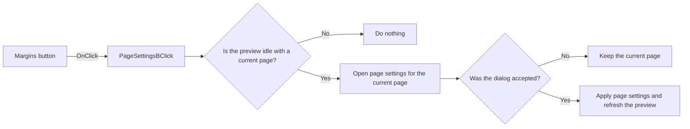

# Margins

> Analysis status: Reviewed from recovered source and graph evidence.

## Control

| Property | Recovered value |
| --- | --- |
| Form | frxPreviewForm |
| Component path | frxPreviewForm.ToolBar.PageSettingsB |
| Control class | TToolButton |
| Caption | Margins |
| Hint | Not present in the recovered resource. |
| Text | Not present in the recovered resource. |
| Handler name | PageSettingsBClick |
| Handler address | 018af6b0 |
| Graph node | `resource:dfm:frxPreviewForm/frxPreviewForm.ToolBar.PageSettingsB` |
| Handler node | `function:018af6b0` |
| Graph layer | UI |

## What happens when clicked

When the preview is idle and a current prepared page exists, the handler creates the FastReport page-settings dialog. It supplies the current page and active report, then shows the dialog. An accepted result updates the current prepared page and refreshes the preview through one of two apply paths selected by the dialog state. Cancel, an active generation, or a missing current page leaves the preview unchanged. The dialog object is destroyed after use.

## Click flow

## Handler evidence

- Source: [DecompiledSources/Tina16/functions/00000000018AF6B0__FUN_018af6b0.c](../../../DecompiledSources/Tina16/functions/00000000018AF6B0__FUN_018af6b0.c)
- Recovered role: Opens page settings for the current prepared page and applies accepted changes.
- Current graph summary: Handles 1 Delphi UI event: frxPreviewForm.ToolBar.PageSettingsB.OnClick.
- Current graph behavior: Shows a page-settings dialog only while idle and with a current page; accepted changes update the prepared page and preview, while cancel is a no-op.
- Current graph evidence: `FUN_018af6b0` passes preview field `+0x848` to `FUN_018aaa40`. That callee tests busy byte `+0x531`, gets page `currentPage-1`, creates the dialog class at `PTR_FUN_0189ae80`, assigns the page and report, tests modal result one, applies the accepted page through the prepared-report replacement or refresh path, and destroys the dialog.
- Complexity: simple
- Distinct outgoing calls: 1

## Direct calls

- `function:018aaa40` — FUN_018aaa40

## Resource evidence

- Kind: Not present in the recovered resource.
- Modal result: Not present in the recovered resource.
- Checked state: Not present in the recovered resource.
- List items: Not present in the recovered resource.
- Image reference: Not present in the recovered resource.
- Extracted glyph: None.

## Nearby label candidates

Nearby labels are layout candidates only. They are not proof of behavior.

- No same-parent label candidate is available.

## Analysis limits

- The recovered source does not identify the dialog's internal state that selects the two accepted apply paths.
- The handler has no local exception, retry, or rollback block.
