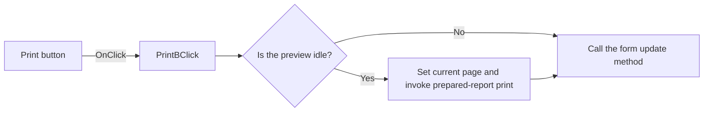

# Print

> Analysis status: Reviewed from recovered source and graph evidence.

## Control

| Property | Recovered value |
| --- | --- |
| Form | frxPreviewForm |
| Component path | frxPreviewForm.ToolBar.PrintB |
| Control class | TToolButton |
| Caption | Print |
| Hint | Not present in the recovered resource. |
| Text | Not present in the recovered resource. |
| Handler name | PrintBClick |
| Handler address | 018af0c0 |
| Graph node | `resource:dfm:frxPreviewForm/frxPreviewForm.ToolBar.PrintB` |
| Handler node | `function:018af0c0` |
| Graph layer | UI |

## What happens when clicked

When the preview is idle, the handler sets the prepared report's current page from preview field `+0x528`, invokes the prepared-report print method, and signals that the preview state must update. It then calls a form virtual method at offset `+0x128` with value one. A click while preview generation is active does not start printing, but the form virtual method still runs.

## Click flow

## Handler evidence

- Source: [DecompiledSources/Tina16/functions/00000000018AF0C0__FUN_018af0c0.c](../../../DecompiledSources/Tina16/functions/00000000018AF0C0__FUN_018af0c0.c)
- Recovered role: Starts printing the prepared report from the current preview page.
- Current graph summary: Handles 1 Delphi UI event: frxPreviewForm.ToolBar.PrintB.OnClick.
- Current graph behavior: While idle, selects the current page and invokes the prepared-report print method; it then calls a form update method on both busy and idle paths.
- Current graph evidence: `FUN_018af0c0` calls `FUN_018a9f30` for preview field `+0x848` and then calls form VMT offset `+0x128` with one. `FUN_018a9f30` returns early when busy byte `+0x531` is set; otherwise it writes current page field `+0x528`, invokes prepared-report VMT slot `+0x160`, and signals preview update through VMT slot `+0x2a0`.
- Complexity: simple
- Distinct outgoing calls: 1

## Direct calls

- `function:018a9f30` — FUN_018a9f30

## Resource evidence

- Kind: Not present in the recovered resource.
- Modal result: Not present in the recovered resource.
- Checked state: Not present in the recovered resource.
- List items: Not present in the recovered resource.
- Image reference: Not present in the recovered resource.
- Extracted glyph: None.

## Nearby label candidates

Nearby labels are layout candidates only. They are not proof of behavior.

- No same-parent label candidate is available.

## Analysis limits

- The recovered source does not identify the form virtual method at offset `+0x128`.
- Printer-dialog behavior and print errors are below the recovered virtual print method and are not established here.
