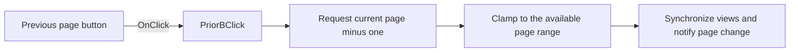

# Prior

> Analysis status: Reviewed from recovered source and graph evidence.

## Control

| Property | Recovered value |
| --- | --- |
| Form | frxPreviewForm |
| Component path | frxPreviewForm.ToolBar.PriorB |
| Control class | TToolButton |
| Caption | Prior |
| Hint | Not present in the recovered resource. |
| Text | Not present in the recovered resource. |
| Handler name | PriorBClick |
| Handler address | 018afb00 |
| Graph node | `resource:dfm:frxPreviewForm/frxPreviewForm.ToolBar.PriorB` |
| Handler node | `function:018afb00` |
| Graph layer | UI |

## What happens when clicked

The handler requests the current one-based page number minus one. The shared page-selection routine clamps the result to the available range. It updates the current page in the main and thumbnail views, adjusts their scroll positions, invokes the page-change callback, and ends the guarded update. A click on page 1 stays on page 1.

## Click flow

## Handler evidence

- Source: [DecompiledSources/Tina16/functions/00000000018AFB00__FUN_018afb00.c](../../../DecompiledSources/Tina16/functions/00000000018AFB00__FUN_018afb00.c)
- Recovered role: Selects the previous page in the FastReport preview.
- Current graph summary: Handles 1 Delphi UI event: frxPreviewForm.ToolBar.PriorB.OnClick.
- Current graph behavior: Decrements the requested page, clamps it to the report, and synchronizes the main preview, thumbnail view, scrolling, and callback.
- Current graph evidence: `FUN_018afb00` calls `FUN_018a9ed0`. That callee reads current page field `+0x528`, subtracts one, and passes the result to `FUN_018a9020`. The shared routine clamps the value to 1 through page count and applies it to both preview controls.
- Complexity: simple
- Distinct outgoing calls: 1

## Direct calls

- `function:018a9ed0` — FUN_018a9ed0

## Resource evidence

- Kind: Not present in the recovered resource.
- Modal result: Not present in the recovered resource.
- Checked state: Not present in the recovered resource.
- List items: Not present in the recovered resource.
- Image reference: Not present in the recovered resource.
- Extracted glyph: None.

## Nearby label candidates

Nearby labels are layout candidates only. They are not proof of behavior.

- No same-parent label candidate is available.

## Analysis limits

- On page 1, clamping makes the click an effective no-op for page position.
- The page-selection routine has no local error or retry path.
