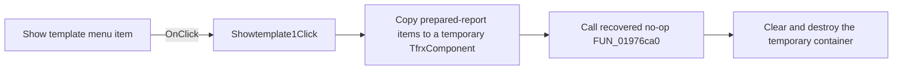

# Show template

> Analysis status: Reviewed from recovered source and graph evidence.

## Control

| Property | Recovered value |
| --- | --- |
| Form | frxPreviewForm |
| Component path | frxPreviewForm.HiddenMenu.Showtemplate1 |
| Control class | TMenuItem |
| Caption | Show template |
| Hint | Not present in the recovered resource. |
| Text | Not present in the recovered resource. |
| Handler name | Showtemplate1Click |
| Handler address | 018afe50 |
| Graph node | `resource:dfm:frxPreviewForm/frxPreviewForm.HiddenMenu.Showtemplate1` |
| Handler node | `function:018afe50` |
| Graph layer | UI |

## What happens when clicked

The handler passes the active FastReport preview object to `FUN_018ab020`. That routine creates a temporary `TfrxComponent` container, copies each item from the current prepared-report collection into it, invokes `FUN_01976ca0`, clears the temporary collection, and destroys the container. The recovered `FUN_01976ca0` body returns without an operation. Therefore, the recovered path proves the temporary copy, but it does not prove a visible template window or a persistent state change.

## Click flow

## Handler evidence

- Source: [DecompiledSources/Tina16/functions/00000000018AFE50__FUN_018afe50.c](../../../DecompiledSources/Tina16/functions/00000000018AFE50__FUN_018afe50.c)
- Recovered role: Builds and discards a temporary prepared-report component container for the Show template command.
- Current graph summary: Handles 1 Delphi UI event: frxPreviewForm.HiddenMenu.Showtemplate1.OnClick.
- Current graph behavior: Copies the current prepared-report items to a temporary container, calls a recovered no-op routine, and then destroys the container.
- Current graph evidence: `FUN_018afe50` calls `FUN_018ab020` with form field `+0x848`. `FUN_018ab020` iterates the current collection, adds each item to a temporary `TfrxComponent`, calls `FUN_01976ca0`, clears the collection, and destroys the container. `FUN_01976ca0` is one `RET` path in the recovered source.
- Complexity: simple
- Distinct outgoing calls: 1

## Direct calls

- `function:018ab020` — FUN_018ab020

## Resource evidence

- Kind: Not present in the recovered resource.
- Modal result: Not present in the recovered resource.
- Checked state: Not present in the recovered resource.
- List items: Not present in the recovered resource.
- Image reference: Not present in the recovered resource.
- Extracted glyph: None.

## Nearby label candidates

Nearby labels are layout candidates only. They are not proof of behavior.

- No same-parent label candidate is available.

## Analysis limits

- The recovered path does not establish why the command is named Show template.
- The source does not show a dialog, error branch, or persistent output for this click.
