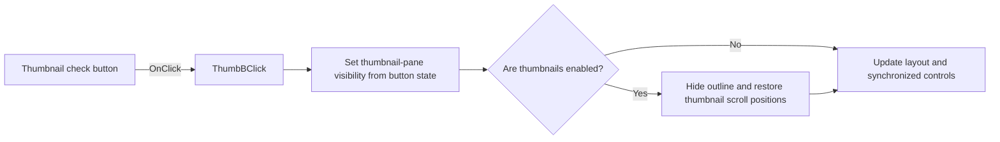

# ThumbB

> Analysis status: Reviewed from recovered source and graph evidence.

## Control

| Property | Recovered value |
| --- | --- |
| Form | frxPreviewForm |
| Component path | frxPreviewForm.ToolBar.ThumbB |
| Control class | TToolButton |
| Caption | ThumbB |
| Hint | Not present in the recovered resource. |
| Text | Not present in the recovered resource. |
| Handler name | ThumbBClick |
| Handler address | 018b0210 |
| Graph node | `resource:dfm:frxPreviewForm/frxPreviewForm.ToolBar.ThumbB` |
| Handler node | `function:018b0210` |
| Graph layer | UI |

## What happens when clicked

The check button controls the thumbnail pane. The handler passes the button state to `FUN_018a8ea0`. The setter shows or hides the thumbnail control, updates the related pane, runs the preview layout callback, and synchronizes the button state. Turning thumbnails on hides the outline pane and restores the thumbnail scroll positions. A state change refreshes the preview; a repeated state avoids that final refresh.

## Click flow

## Handler evidence

- Source: [DecompiledSources/Tina16/functions/00000000018B0210__FUN_018b0210.c](../../../DecompiledSources/Tina16/functions/00000000018B0210__FUN_018b0210.c)
- Recovered role: Toggles the FastReport preview thumbnail pane and keeps it exclusive with the outline.
- Current graph summary: Handles 1 Delphi UI event: frxPreviewForm.ToolBar.ThumbB.OnClick.
- Current graph behavior: Shows or hides thumbnails from the check-button state, hides the outline when thumbnails are enabled, restores thumbnail scroll positions, synchronizes controls, and refreshes after a state change.
- Current graph evidence: `FUN_018b0210` reads button byte `+0x31a` from form field `+0x7e0` and calls `FUN_018a8ea0`. That callee updates controls at preview offsets `+0x540` and `+0x538`, invokes a layout callback, disables the control at `+0x500` and restores two scroll fields when enabling thumbnails, synchronizes the form button, and calls `FUN_018aba70` only when the state differs.
- Complexity: simple
- Distinct outgoing calls: 1

## Direct calls

- `function:018a8ea0` — FUN_018a8ea0

## Resource evidence

- Kind: Not present in the recovered resource.
- Modal result: Not present in the recovered resource.
- Checked state: Not present in the recovered resource.
- List items: Not present in the recovered resource.
- Image reference: Not present in the recovered resource.
- Extracted glyph: None.

## Nearby label candidates

Nearby labels are layout candidates only. They are not proof of behavior.

- No same-parent label candidate is available.

## Analysis limits

- The DFM caption is the component name; the field name and state path identify the thumbnail control.
- The handler has no local error or rollback path.
