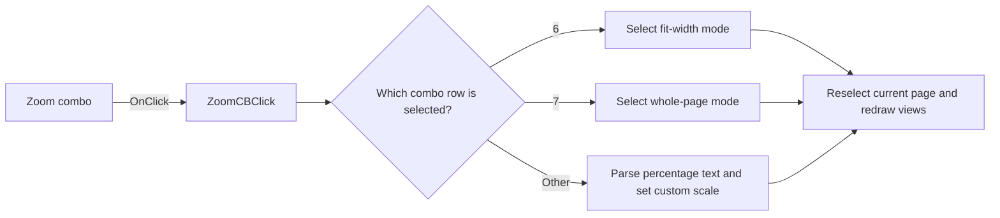

# ZoomCB

> Analysis status: Reviewed from recovered source and graph evidence.

## Control

| Property | Recovered value |
| --- | --- |
| Form | frxPreviewForm |
| Component path | frxPreviewForm.ToolBar.Sep3.ZoomCB |
| Control class | TfrxComboBox |
| Caption | Not present in the recovered resource. |
| Hint | Not present in the recovered resource. |
| Text | 100% |
| Handler name | ZoomCBClick |
| Handler address | 018af390 |
| Graph node | `resource:dfm:frxPreviewForm/frxPreviewForm.ToolBar.Sep3.ZoomCB` |
| Handler node | `function:018af390` |
| Graph layer | UI |

## What happens when clicked

The handler first ends any active find interaction and preserves the prior page marker. Combo row 6 selects FastReport fit-width mode, and row 7 selects whole-page mode. Other rows read the combo text, remove a percent sign and spaces, convert a nonempty value to a number, divide it by 100, and set a custom scale. The custom-scale setter enforces a minimum of 25 percent and clears fit mode. The handler then updates the combo, reselects the current page so both preview views redraw, and clears the saved page marker. Invalid nonempty numeric text reaches the converter without local error handling.

## Click flow

## Handler evidence

- Source: [DecompiledSources/Tina16/functions/00000000018AF390__FUN_018af390.c](../../../DecompiledSources/Tina16/functions/00000000018AF390__FUN_018af390.c)
- Recovered role: Applies a FastReport preview zoom mode or numeric zoom percentage from the zoom combo.
- Current graph summary: Handles 1 Delphi UI event: frxPreviewForm.ToolBar.Sep3.ZoomCB.OnClick.
- Current graph behavior: Maps combo rows 6 and 7 to the two fit modes, or parses percentage text into a custom scale with a 25-percent minimum, then redraws the current page.
- Current graph evidence: `FUN_018af390` reads the combo row from form field `+0x718`; exact rows 6 and 7 call `FUN_018a8d80` with modes 2 and 1. The other branch reads control text, removes delimiters, converts through `FUN_0180d800`, divides by 100, and calls `FUN_018a8d30`. `FUN_018a8d30` clamps values below 0.25 and clears fit mode. The handler finally calls `FUN_018a9020` for the current page.
- Complexity: complex
- Distinct outgoing calls: 10

## Direct calls

- `function:00414480` — Delphi UnicodeString clear and finalization helper
- `function:00414de0` — FUN_00414de0
- `function:00416e20` — FUN_00416e20
- `function:004170c0` — FUN_004170c0
- `function:0064dd90` — VCL control Unicode text reader
- `function:0065b870` — FUN_0065b870
- `function:0180d800` — FUN_0180d800
- `function:018a8d30` — FUN_018a8d30
- `function:018a8d80` — FUN_018a8d80
- `function:018a9020` — FUN_018a9020

## Resource evidence

- Kind: Not present in the recovered resource.
- Modal result: Not present in the recovered resource.
- Checked state: Not present in the recovered resource.
- List items: Not present in the recovered resource.
- Image reference: Not present in the recovered resource.
- Extracted glyph: None.

## Nearby label candidates

Nearby labels are layout candidates only. They are not proof of behavior.

- No same-parent label candidate is available.

## Analysis limits

- The combo item strings are populated at runtime and are not present in the DFM; the fit-mode names come from the proven layout calculations in `FUN_018aba70`.
- Invalid nonempty numeric text has no local catch, fallback, or retry branch.
