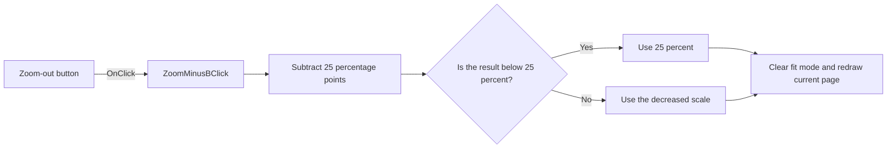

# Whole Page

> Analysis status: Reviewed from recovered source and graph evidence.

## Control

| Property | Recovered value |
| --- | --- |
| Form | frxPreviewForm |
| Component path | frxPreviewForm.ToolBar.ZoomMinusB |
| Control class | TToolButton |
| Caption | Whole Page |
| Hint | Not present in the recovered resource. |
| Text | Not present in the recovered resource. |
| Handler name | ZoomMinusBClick |
| Handler address | 018af250 |
| Graph node | `resource:dfm:frxPreviewForm/frxPreviewForm.ToolBar.ZoomMinusB` |
| Handler node | `function:018af250` |
| Graph layer | UI |

## What happens when clicked

The handler subtracts `0.25` from the current custom zoom scale at preview offset `+0x558`. The scale setter clamps the result to a minimum of `0.25`, clears fit mode, and refreshes preview layout. The handler then runs the zoom-combo synchronization path, which reselects the current page and redraws both preview views. At 25 percent, another click remains at 25 percent.

## Click flow

## Handler evidence

- Source: [DecompiledSources/Tina16/functions/00000000018AF250__FUN_018af250.c](../../../DecompiledSources/Tina16/functions/00000000018AF250__FUN_018af250.c)
- Recovered role: Decreases the FastReport preview zoom by 25 percentage points with a 25-percent minimum.
- Current graph summary: Handles 1 Delphi UI event: frxPreviewForm.ToolBar.ZoomMinusB.OnClick.
- Current graph behavior: Subtracts 0.25 from the custom scale, clamps it to 0.25, clears fit mode, and synchronizes the zoom combo and current-page redraw.
- Current graph evidence: `FUN_018af250` reads double `preview+0x558`, subtracts `0.25`, passes the value to `FUN_018a8d30`, and calls `FUN_018af390`. `FUN_018a8d30` stores the scale, replaces a value below `0.25` with `0.25`, clears mode byte `+0x560`, and refreshes layout.
- Complexity: moderate
- Distinct outgoing calls: 2

## Direct calls

- `function:018a8d30` — FUN_018a8d30
- `function:018af390` — Handles 1 Delphi UI event: frxPreviewForm.ToolBar.Sep3.ZoomCB.OnClick.

## Resource evidence

- Kind: Not present in the recovered resource.
- Modal result: Not present in the recovered resource.
- Checked state: Not present in the recovered resource.
- List items: Not present in the recovered resource.
- Image reference: Not present in the recovered resource.
- Extracted glyph: None.

## Nearby label candidates

Nearby labels are layout candidates only. They are not proof of behavior.

- No same-parent label candidate is available.

## Analysis limits

- The recovered DFM caption says Whole Page, but the handler body proves a 25-percentage-point zoom decrease; the article follows the code path.
- The handler has no local error or rollback path.
