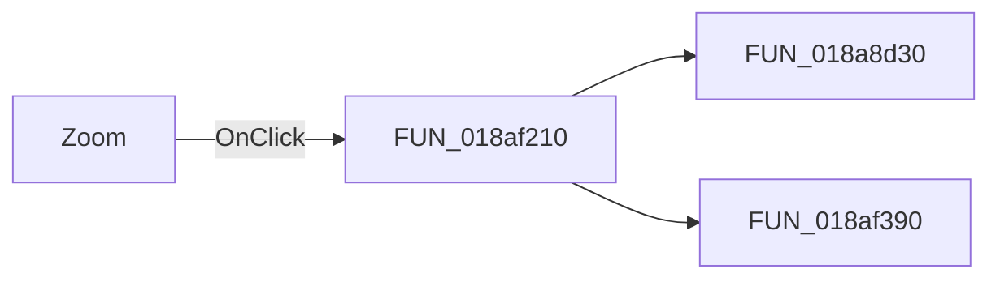

# Zoom

> Analysis status: Pending individual source review.

## Control

| Property | Recovered value |
| --- | --- |
| Form | frxPreviewForm |
| Component path | frxPreviewForm.ToolBar.ZoomPlusB |
| Control class | TToolButton |
| Caption | Zoom |
| Hint | Not present in the recovered resource. |
| Text | Not present in the recovered resource. |
| Handler name | ZoomPlusBClick |
| Handler address | 018af210 |
| Graph node | `resource:dfm:frxPreviewForm/frxPreviewForm.ToolBar.ZoomPlusB` |
| Handler node | `function:018af210` |
| Graph layer | UI |

## What happens when clicked

Pending individual analysis. An agent must read the recovered handler source and its relevant callees before it replaces this text.

## Click flow

## Handler evidence

- Source: [DecompiledSources/Tina16/functions/00000000018AF210__FUN_018af210.c](../../../DecompiledSources/Tina16/functions/00000000018AF210__FUN_018af210.c)
- Recovered role: Not present in the recovered resource.
- Current graph summary: Handles 1 Delphi UI event: frxPreviewForm.ToolBar.ZoomPlusB.OnClick.
- Current graph behavior: Not present in the recovered resource.
- Current graph evidence: Not present in the recovered resource.
- Complexity: moderate
- Distinct outgoing calls: 2

## Direct calls

- `function:018a8d30` — FUN_018a8d30
- `function:018af390` — Handles 1 Delphi UI event: frxPreviewForm.ToolBar.Sep3.ZoomCB.OnClick.

## Resource evidence

- Kind: Not present in the recovered resource.
- Modal result: Not present in the recovered resource.
- Checked state: Not present in the recovered resource.
- List items: Not present in the recovered resource.
- Image reference: Not present in the recovered resource.
- Extracted glyph: None.

## Nearby label candidates

Nearby labels are layout candidates only. They are not proof of behavior.

- No same-parent label candidate is available.

## Analysis limits

- Do not infer behavior from the control class, caption, hint, glyph, or nearby label alone.
- Do not replace the pending status until the handler source and relevant call path provide enough evidence.
