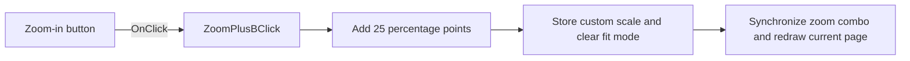

# Zoom

> Analysis status: Reviewed from recovered source and graph evidence.

## Control

| Property | Recovered value |
| --- | --- |
| Form | frxPreviewForm |
| Component path | frxPreviewForm.ToolBar.ZoomPlusB |
| Control class | TToolButton |
| Caption | Zoom |
| Hint | Not present in the recovered resource. |
| Text | Not present in the recovered resource. |
| Handler name | ZoomPlusBClick |
| Handler address | 018af210 |
| Graph node | `resource:dfm:frxPreviewForm/frxPreviewForm.ToolBar.ZoomPlusB` |
| Handler node | `function:018af210` |
| Graph layer | UI |

## What happens when clicked

The handler adds `0.25` to the current custom zoom scale at preview offset `+0x558`. The scale setter stores the result, clears fit mode, and refreshes preview layout. The handler then runs the zoom-combo synchronization path, which reselects the current page and redraws both preview views. The recovered path does not impose a maximum zoom.

## Click flow

## Handler evidence

- Source: [DecompiledSources/Tina16/functions/00000000018AF210__FUN_018af210.c](../../../DecompiledSources/Tina16/functions/00000000018AF210__FUN_018af210.c)
- Recovered role: Increases the FastReport preview zoom by 25 percentage points.
- Current graph summary: Handles 1 Delphi UI event: frxPreviewForm.ToolBar.ZoomPlusB.OnClick.
- Current graph behavior: Adds 0.25 to the custom scale, clears fit mode, and synchronizes the zoom combo and current-page redraw.
- Current graph evidence: `FUN_018af210` reads double `preview+0x558`, adds `0.25`, passes the value to `FUN_018a8d30`, and calls `FUN_018af390`. `FUN_018a8d30` stores the scale, clears mode byte `+0x560`, and refreshes layout. The minimum clamp cannot affect an increment from a valid scale.
- Complexity: moderate
- Distinct outgoing calls: 2

## Direct calls

- `function:018a8d30` — FUN_018a8d30
- `function:018af390` — Handles 1 Delphi UI event: frxPreviewForm.ToolBar.Sep3.ZoomCB.OnClick.

## Resource evidence

- Kind: Not present in the recovered resource.
- Modal result: Not present in the recovered resource.
- Checked state: Not present in the recovered resource.
- List items: Not present in the recovered resource.
- Image reference: Not present in the recovered resource.
- Extracted glyph: None.

## Nearby label candidates

Nearby labels are layout candidates only. They are not proof of behavior.

- No same-parent label candidate is available.

## Analysis limits

- The recovered handler does not impose or report a maximum zoom value.
- The handler has no local error or rollback path.
