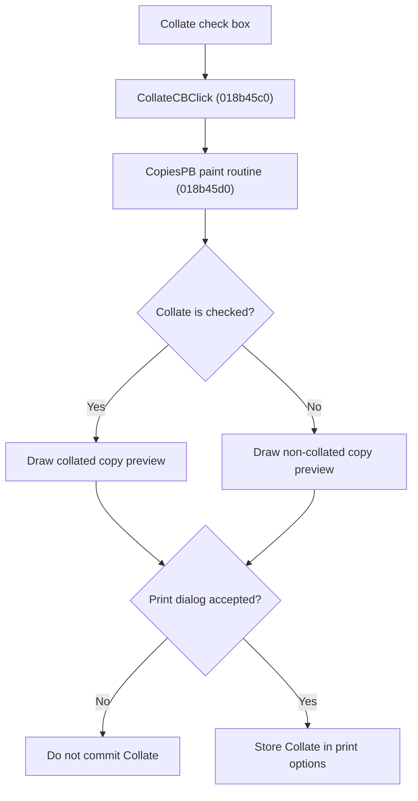

# Collate Printed Copies

> Analysis status: Source reviewed for `TIARA-diz.6.7.2087`.

## Control

| Property | Recovered value |
| --- | --- |
| Form | frxPrintDialog |
| Component path | frxPrintDialog.Label2.CollateCB |
| Control class | TCheckBox |
| Caption | Collate |
| Hint | Not present in the recovered resource. |
| Handler name | CollateCBClick |
| Handler address | 018b45c0 |
| Graph node | `resource:dfm:frxPrintDialog/frxPrintDialog.Label2.CollateCB` |
| Handler node | `function:018b45c0` |
| Graph layer | UI |

## What happens when clicked

- The VCL check box changes its checked state before this handler runs.
- The handler immediately calls the CopiesPB paint routine.
- The paint routine clears the preview and draws the collated illustration when checked or the non-collated illustration when unchecked.
- The click does not start printing. On an accepted close, FormHide stores the checked state in the report print options. Cancel does not commit it.
- FastReport uses Collate to choose between printing each complete copy in sequence and printing all copies of one page before the next page.

## Click flow

## Handler evidence

- Source: [FUN_018b45c0](../../../DecompiledSources/Tina16/functions/00000000018B45C0__FUN_018b45c0.c)
- Recovered role: Repaint the copies preview for the current Collate state.
- The DFM binds CollateCB.OnClick to FUN_018b45c0 and marks it initially checked.
- FUN_018b45c0 calls FUN_018b45d0. That paint routine reads CollateCB, clears CopiesPB, and draws one of two sibling embedded images.
- The inspected 74x53 Collate image shows complete ordered page sets. The 92x40 NonCollate image groups repeated copies of page 1, page 2, and page 3.
- FUN_018b30b0 copies the Collate checked state to print-options byte +0x0C only when ModalResult is 1.
- Relevant source: [FUN_018b45d0](../../../DecompiledSources/Tina16/functions/00000000018B45D0__FUN_018b45d0.c)
- Relevant source: [FUN_018b30b0](../../../DecompiledSources/Tina16/functions/00000000018B30B0__FUN_018b30b0.c)

## FastReport framework context

- [FastReport VCL print-dialog documentation](https://www.fast-report.com/public_download/docs/FRVCL/online/en/FastReportVCL/UserManual/en-US/Report_viewing_printing_and_export/Report_printing.html) confirms the user-visible printer, page-range, collation, and print-mode meanings. The recovered handler and lifecycle sources above establish this control's implementation.

## Resource evidence

- Checked state: true.
- Sibling images: `CollateImg` and `NonCollateImg`.
- Extracted images: [collated copy preview](../../../glyph/0208_frxPrintDialog_frxPrintDialog_Label2_CollateImg_Picture_Data.png) and [non-collated copy preview](../../../glyph/0209_frxPrintDialog_frxPrintDialog_Label2_NonCollateImg_Picture_Data.png).
- The nearby Number of copies label describes the group, not this handler's data input.

## Analysis limits

- No runtime printer or live print test was performed.
- The explanation does not infer implementation from the caption, nearby label, or image alone.
- Unknown owner-draw text and private field names remain explicit where the recovered DFM does not provide them.
