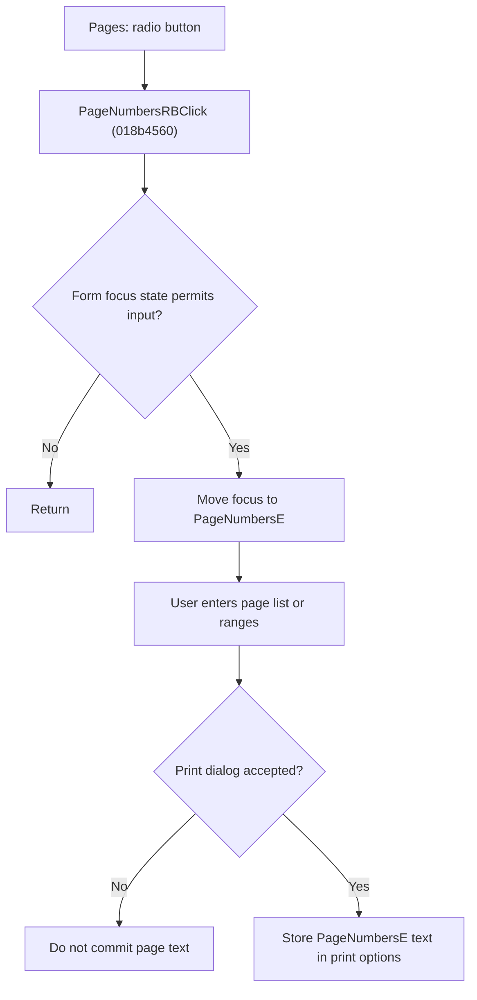

# Select a Page Range

> Analysis status: Source reviewed for `TIARA-diz.6.7.2084`.

## Control

| Property | Recovered value |
| --- | --- |
| Form | frxPrintDialog |
| Component path | frxPrintDialog.Label1.PageNumbersRB |
| Control class | TRadioButton |
| Caption | Pages: |
| Hint | Not present in the recovered resource. |
| Handler name | PageNumbersRBClick |
| Handler address | 018b4560 |
| Graph node | `resource:dfm:frxPrintDialog/frxPrintDialog.Label1.PageNumbersRB` |
| Handler node | `function:018b4560` |
| Graph layer | UI |

## What happens when clicked

- The VCL radio-button click selects the Pages option before this handler runs.
- The handler tests a recovered form-state byte. When that state permits it, it invokes the focus method on PageNumbersE.
- It does not parse, clear, or validate the page-number text.
- Entering PageNumbersE through the keyboard also selects PageNumbersRB. On an accepted close, the form stores the edit text as the requested page specification. Cancel does not commit it.

## Click flow

## Handler evidence

- Source: [FUN_018b4560](../../../DecompiledSources/Tina16/functions/00000000018B4560__FUN_018b4560.c)
- Recovered role: Move input focus to the custom page-number editor when the dialog can accept focus.
- The DFM binds PageNumbersRB.OnClick to FUN_018b4560 and places PageNumbersE beside it.
- FUN_018b4560 tests form byte +0xA9 and makes one indirect call through PageNumbersE at form field +0x748.
- FUN_018b4540, the PageNumbersE.OnEnter handler, sets PageNumbersRB checked. FUN_018b30b0 reads PageNumbersRB and PageNumbersE only when ModalResult is 1.
- The nearby instruction gives the accepted syntax example `1,3,5-12`; the click handler itself contains no syntax check.
- Relevant source: [FUN_018b4540](../../../DecompiledSources/Tina16/functions/00000000018B4540__FUN_018b4540.c)
- Relevant source: [FUN_018b30b0](../../../DecompiledSources/Tina16/functions/00000000018B30B0__FUN_018b30b0.c)

## FastReport framework context

- [FastReport VCL print-dialog documentation](https://www.fast-report.com/public_download/docs/FRVCL/online/en/FastReportVCL/UserManual/en-US/Report_viewing_printing_and_export/Report_printing.html) confirms the user-visible printer, page-range, collation, and print-mode meanings. The recovered handler and lifecycle sources above establish this control's implementation.

## Resource evidence

- The Pages group initially selects All, not Pages.
- Nearby instruction: Enter page numbers and/or page ranges, separated by commas. For example, 1,3,5-12.
- No glyph or embedded image belongs to this control.

## Analysis limits

- No runtime printer or live print test was performed.
- The explanation does not infer implementation from the caption, nearby label, or image alone.
- Unknown owner-draw text and private field names remain explicit where the recovered DFM does not provide them.
