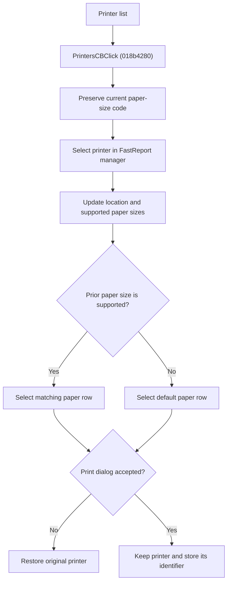

# Select a Printer

> Analysis status: Source reviewed for `TIARA-diz.6.7.2085`.

## Control

| Property | Recovered value |
| --- | --- |
| Form | frxPrintDialog |
| Component path | frxPrintDialog.Label12.PrintersCB |
| Control class | TComboBox |
| Caption | No static caption |
| Hint | Not present in the recovered resource. |
| Handler name | PrintersCBClick |
| Handler address | 018b4280 |
| Graph node | `resource:dfm:frxPrintDialog/frxPrintDialog.Label12.PrintersCB` |
| Handler node | `function:018b4280` |
| Graph layer | UI |

## What happens when clicked

- Preserves the current paper-size choice as a printer paper code when possible.
- Switches the FastReport printer manager to the selected printer row.
- Updates the Where value from the selected printer, replaces the Print on paper list with that printer's supported paper sizes, and inserts the localized default-paper row.
- Tries to restore the prior paper size by code. If it is not available, selects the default row.
- It does not print. If the print dialog is canceled, FormHide restores the printer that was active when the dialog opened. An accepted close keeps the selected printer and stores its identifier in the report print options.

## Click flow

## Handler evidence

- Source: [FUN_018b4280](../../../DecompiledSources/Tina16/functions/00000000018B4280__FUN_018b4280.c)
- Recovered role: Switch the FastReport printer and rebuild its paper-size choices.
- The DFM binds PrintersCB.OnClick to FUN_018b4280; FormCreate populates the printer combo from the FastReport printer manager and saves the original printer index.
- FUN_018b4280 maps the old paper text through FUN_0188b960, selects the printer through FUN_0188d0f0, updates the location label, assigns the printer paper list, inserts `pgDefault`, and maps the old code back with FUN_0188b8b0.
- FUN_018b30b0 restores form field +0x7F8 on cancellation and stores the accepted printer code on ModalResult 1.
- Relevant source: [FUN_018b2d80](../../../DecompiledSources/Tina16/functions/00000000018B2D80__FUN_018b2d80.c)
- Relevant source: [FUN_018b30b0](../../../DecompiledSources/Tina16/functions/00000000018B30B0__FUN_018b30b0.c)
- Relevant source: [FUN_0188d0f0](../../../DecompiledSources/Tina16/functions/000000000188D0F0__FUN_0188d0f0.c)
- Relevant source: [FUN_0188b8b0](../../../DecompiledSources/Tina16/functions/000000000188B8B0__FUN_0188b8b0.c)
- Relevant source: [FUN_0188b960](../../../DecompiledSources/Tina16/functions/000000000188B960__FUN_0188b960.c)

## FastReport framework context

- [FastReport VCL print-dialog documentation](https://www.fast-report.com/public_download/docs/FRVCL/online/en/FastReportVCL/UserManual/en-US/Report_viewing_printing_and_export/Report_printing.html) confirms the user-visible printer, page-range, collation, and print-mode meanings. The recovered handler and lifecycle sources above establish this control's implementation.

## Resource evidence

- The Printer group contains Name, Where, Properties, and Print to file controls.
- The printer combo is owner-drawn and has no static DFM item list.
- No glyph or embedded image belongs to this control.

## Analysis limits

- No runtime printer or live print test was performed.
- The explanation does not infer implementation from the caption, nearby label, or image alone.
- Unknown owner-draw text and private field names remain explicit where the recovered DFM does not provide them.
