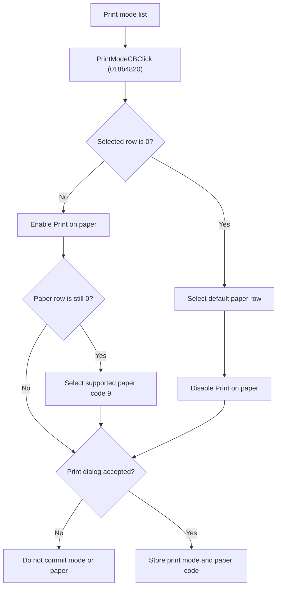

# Select a FastReport Print Mode

> Analysis status: Source reviewed for `TIARA-diz.6.7.2088`.

## Control

| Property | Recovered value |
| --- | --- |
| Form | frxPrintDialog |
| Component path | frxPrintDialog.ScaleGB.PrintModeCB |
| Control class | TComboBox |
| Caption | No static caption |
| Hint | Not present in the recovered resource. |
| Handler name | PrintModeCBClick |
| Handler address | 018b4820 |
| Graph node | `resource:dfm:frxPrintDialog/frxPrintDialog.ScaleGB.PrintModeCB` |
| Handler node | `function:018b4820` |
| Graph layer | UI |

## What happens when clicked

- Reads the selected print-mode row.
- For row 0, selects the default paper row and disables the Print on paper combo.
- For every nonzero mode, enables the paper combo. If that combo still has row 0, selects the row that maps to printer paper code 9 when the current printer supports it.
- The click does not print and does not commit report options. On an accepted close, FormHide stores the print-mode row and selected paper code. Cancel does not commit them.
- This matches FastReport's framework rule: Default mode uses the report page sheet, while non-default modes require a target sheet size.

## Click flow

## Handler evidence

- Source: [FUN_018b4820](../../../DecompiledSources/Tina16/functions/00000000018B4820__FUN_018b4820.c)
- Recovered role: Enable or disable paper-size selection for the FastReport print mode.
- The DFM binds PrintModeCB.OnClick to FUN_018b4820. The owner-drawn combo has no static DFM item list.
- FUN_018b4820 tests PrintModeCB.ItemIndex at form +0x7B0, changes PagPageSizeCB at +0x798, and uses FUN_0188b8b0 to find paper code 9 for a non-default mode with no explicit paper selected.
- FUN_018b30b0 stores the print-mode index and maps the accepted paper-size text back to a printer code only on ModalResult 1.
- Official FastReport VCL documentation identifies Default, Split big pages, Join small pages, and Scale as print-mode concepts; only the index-zero versus nonzero behavior is proven for this recovered handler.
- Relevant source: [FUN_018b30b0](../../../DecompiledSources/Tina16/functions/00000000018B30B0__FUN_018b30b0.c)
- Relevant source: [FUN_0188b8b0](../../../DecompiledSources/Tina16/functions/000000000188B8B0__FUN_0188b8b0.c)

## FastReport framework context

- [FastReport VCL print-dialog documentation](https://www.fast-report.com/public_download/docs/FRVCL/online/en/FastReportVCL/UserManual/en-US/Report_viewing_printing_and_export/Report_printing.html) confirms the user-visible printer, page-range, collation, and print-mode meanings. The recovered handler and lifecycle sources above establish this control's implementation.

## Resource evidence

- Parent group caption: Print mode.
- Nearby dependent label: Print on paper.
- The combo is owner-drawn through PrintModeIL and has no extracted static item text.
- No control glyph is present; the separate image list supplies owner-draw images.

## Analysis limits

- No runtime printer or live print test was performed.
- The explanation does not infer implementation from the caption, nearby label, or image alone.
- Unknown owner-draw text and private field names remain explicit where the recovered DFM does not provide them.
