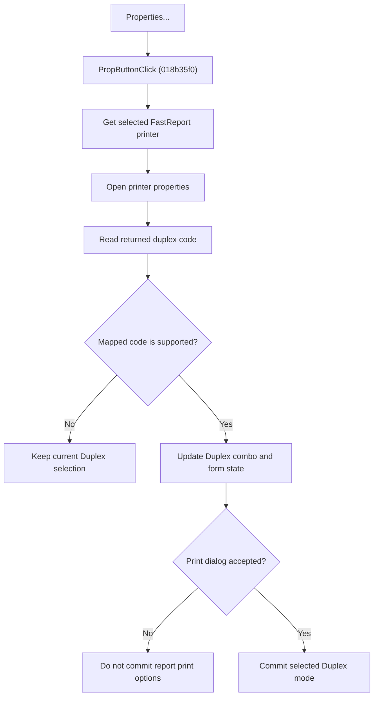

# Open Printer Properties

> Analysis status: Source reviewed for `TIARA-diz.6.7.2086`.

## Control

| Property | Recovered value |
| --- | --- |
| Form | frxPrintDialog |
| Component path | frxPrintDialog.Label12.PropButton |
| Control class | TButton |
| Caption | Properties... |
| Hint | Not present in the recovered resource. |
| Handler name | PropButtonClick |
| Handler address | 018b35f0 |
| Graph node | `resource:dfm:frxPrintDialog/frxPrintDialog.Label12.PropButton` |
| Handler node | `function:018b35f0` |
| Graph layer | UI |

## What happens when clicked

- Gets the printer that is active in the FastReport printer manager and invokes its properties operation.
- After the printer properties dialog returns, reads the printer's duplex code.
- Maps supported driver values to the print dialog's Duplex combo and stores the mapped value in the form.
- If the returned value is unsupported, leaves the current Duplex selection unchanged.
- This click does not start printing and does not directly commit the report print options. The accepted-close path commits the dialog's Duplex selection.

## Click flow

## Handler evidence

- Source: [FUN_018b35f0](../../../DecompiledSources/Tina16/functions/00000000018B35F0__FUN_018b35f0.c)
- Recovered role: Open the selected printer properties and synchronize the duplex choice.
- The DFM caption is Properties... and the button is in the Printer group.
- FUN_018b35f0 gets the selected FastReport printer through FUN_0188d920/FUN_0188d190 and invokes virtual slot +0x60 on that printer.
- It then reads printer field +0x0C, maps the recovered duplex value, stores it at form +0x818, and sets combo field +0x7E0 only when the mapped result is positive.
- FUN_018b30b0 transfers the Duplex combo selection to the form state only on accepted close.
- Relevant source: [FUN_018b30b0](../../../DecompiledSources/Tina16/functions/00000000018B30B0__FUN_018b30b0.c)
- Relevant source: [FUN_0188d920](../../../DecompiledSources/Tina16/functions/000000000188D920__FUN_0188d920.c)
- Relevant source: [FUN_0188d190](../../../DecompiledSources/Tina16/functions/000000000188D190__FUN_0188d190.c)

## FastReport framework context

- [FastReport VCL print-dialog documentation](https://www.fast-report.com/public_download/docs/FRVCL/online/en/FastReportVCL/UserManual/en-US/Report_viewing_printing_and_export/Report_printing.html) confirms the user-visible printer, page-range, collation, and print-mode meanings. The recovered handler and lifecycle sources above establish this control's implementation.

## Resource evidence

- The official FastReport VCL print dialog describes this control as the place to set printer properties such as print quality.
- No glyph or embedded image belongs to this control.

## Analysis limits

- No runtime printer or live print test was performed.
- The explanation does not infer implementation from the caption, nearby label, or image alone.
- Unknown owner-draw text and private field names remain explicit where the recovered DFM does not provide them.
