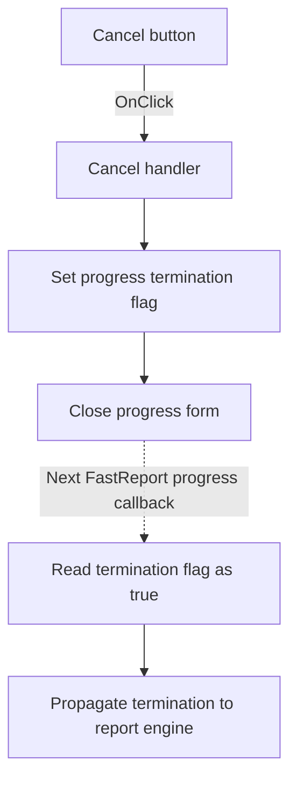

# Cancel

> Analysis status: Individually reviewed from recovered source.

## Control

| Property | Recovered value |
| --- | --- |
| Form | frxProgress |
| Component path | frxProgress.Panel1.CancelB |
| Control class | TButton |
| Caption | Cancel |
| Hint | Not present in the recovered resource. |
| Text | Not present in the recovered resource. |
| Handler name | CancelBClick |
| Handler address | 0181ccc0 |
| Graph node | `resource:dfm:frxProgress/frxProgress.Panel1.CancelB` |
| Handler node | `function:0181ccc0` |
| Graph layer | UI |

## What happens when clicked

The handler passes true to the progress-termination helper. That helper stores true in form field `+0x700` and calls the VCL form close routine. The close routine sets modal result 2 for a modal form or runs the normal close-query and close-action path for a modeless form. The resource also marks this button as the form's cancel button and gives it modal result 2.

The click records a cancellation request; it does not stop report work directly. The recovered FastReport progress callback reads field `+0x700` after it updates the running, exporting, or printing message. When the field is true, it sets the report engine's termination state and calls the recovered engine stop helper. Thus, the next progress callback propagates the request from this form to the report engine.

## Click flow

## Handler evidence

- Source: [DecompiledSources/Tina16/functions/000000000181CCC0__FUN_0181ccc0.c](../../../DecompiledSources/Tina16/functions/000000000181CCC0__FUN_0181ccc0.c)
- Recovered role: Requests FastReport processing cancellation and closes the progress form.
- Current graph summary: Handles 1 Delphi UI event: frxProgress.Panel1.CancelB.OnClick.
- Current graph behavior: Sets the progress termination flag to true and closes the form; the FastReport progress callback later propagates the flag to the report engine.
- Current graph evidence: The click handler calls `0181CCD0` with true. That helper writes the value to form offset `+0x700` and calls `00805200` when it is true. Progress callback `01977820` reads `+0x700` and calls `01977630` with true; that function sets engine field `+0x288` and calls `0184EE00` on the object at engine field `+0x248`.
- Downstream source: [DecompiledSources/Tina16/functions/0000000001977820__FUN_01977820.c](../../../DecompiledSources/Tina16/functions/0000000001977820__FUN_01977820.c)
- Engine termination source: [DecompiledSources/Tina16/functions/0000000001977630__FUN_01977630.c](../../../DecompiledSources/Tina16/functions/0000000001977630__FUN_01977630.c)
- Complexity: simple
- Distinct outgoing calls: 1

## Direct calls

- `function:0181ccd0` — stores the requested termination state and closes the form when the state is true.

## Resource evidence

- Kind: Not present in the recovered resource.
- Modal result: 2
- Cancel button: true.
- Checked state: Not present in the recovered resource.
- List items: Not present in the recovered resource.
- Image reference: Not present in the recovered resource.
- Extracted glyph: None.

## Nearby label candidates

Nearby labels are layout candidates only. They are not proof of behavior.

- Rank 1: LMessage at distance 137.

## Analysis limits

- `LMessage` is a runtime message label. Its nearby position does not add evidence about the cancel implementation.
- The exported source does not recover the Delphi method name for engine helper `0184EE00` or the exact time until the next FastReport progress callback.
- If a modeless close query rejects closure, the termination flag remains true because the helper stores it before it calls the VCL close routine.
