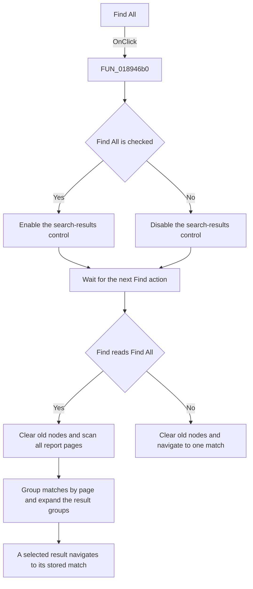

# Find All

> Analysis status: Source reviewed. The result-panel state and the later
> FastReport all-match search path are supported by recovered source.

## Control

| Property | Recovered value |
| --- | --- |
| Form | frxSearchForm |
| Component path | frxSearchForm.pnlSearch.gbSearch.chkFindAll |
| Control class | TCheckBox |
| Caption | Find All |
| Hint | Not present in the recovered resource. |
| Text | Not present in the recovered resource. |
| Handler name | chkFindAllClick |
| Handler address | 018946b0 |
| Graph node | `resource:dfm:frxSearchForm/frxSearchForm.pnlSearch.gbSearch.chkFindAll` |
| Handler node | `function:018946b0` |
| Graph layer | UI |

## What happens when clicked

The click enables or disables the dynamically created search-results control.
It reads the new `Find All` checked state and applies the same Boolean value to
that control's `Enabled` property. The results control is created and disabled
when the form is created.

The checkbox handler does not start a search, clear an old result list, or
change the search text. The next `Find` action reads this checkbox together
with `Text to Find`, `Case sensitive`, and `Search from beginning`.

When `Find All` is checked, the FastReport search path:

- Clears old result nodes and frees their stored match records.
- Scans the report pages for every matching text occurrence.
- Adds each occurrence to the results control and groups it below a page node.
- Expands the page groups after the scan.
- Uses a selected result's stored page and position data to navigate to and
  highlight that occurrence.

If the query, case option, and checked `Find All` state are unchanged after an
all-match scan, a repeated Find action returns without scanning again.

When `Find All` is clear, the next Find action clears any old all-match nodes
and follows the single-match path. It moves to one match according to the
current search position and the `Search from beginning` option.

If a scan finds no match, the recovered framework path displays its localized
`clStrNotFound` message. This error path belongs to the later Find action, not
to the checkbox click.

## Click flow

## Handler evidence

- Source: [DecompiledSources/Tina16/functions/00000000018946B0__FUN_018946b0.c](../../../DecompiledSources/Tina16/functions/00000000018946B0__FUN_018946b0.c)
- Recovered role: FastReport all-match results-control state handler.
- Current graph summary: Handles 1 Delphi UI event: frxSearchForm.pnlSearch.gbSearch.chkFindAll.OnClick.
- Current graph behavior: The checked-in graph does not yet contain a curated behavior description for this function.
- Current graph evidence: The DFM trigger resolves directly to this handler. Its only call sets the dynamically created results control's Enabled property from chkFindAll.Checked.
- Complexity: simple
- Distinct outgoing calls: 1

## Direct calls

- `function:0064dbe0` — [FUN_0064dbe0](../../../DecompiledSources/Tina16/functions/000000000064DBE0__FUN_0064dbe0.c), the VCL enabled-state setter.

Relevant FastReport consumers:

- [FUN_018ac200](../../../DecompiledSources/Tina16/functions/00000000018AC200__FUN_018ac200.c)
  is assigned to the Find button at runtime. It reads the query and all three
  checkboxes, clears stale results, selects the all-match or single-match
  start behavior, runs the search, and expands all-match result groups.
- [FUN_018a6c20](../../../DecompiledSources/Tina16/functions/00000000018A6C20__FUN_018a6c20.c)
  scans report pages and displays the localized not-found message when the scan
  finishes without a match.
- [FUN_018a4a60](../../../DecompiledSources/Tina16/functions/00000000018A4A60__FUN_018a4a60.c)
  compares candidate text with the query. In all-match mode, it adds a result
  record under a localized page node instead of stopping at the first match.
- [FUN_018ac0e0](../../../DecompiledSources/Tina16/functions/00000000018AC0E0__FUN_018ac0e0.c)
  consumes a selected result record and navigates to its stored report page
  and match position.
- [FUN_01894a70](../../../DecompiledSources/Tina16/functions/0000000001894A70__FUN_01894a70.c)
  frees stored match records and clears the dynamic results control.

## Resource evidence

- Kind: Not present in the recovered resource.
- Modal result: Not present in the recovered resource.
- Checked state: Not present in the recovered resource.
- List items: Not present in the recovered resource.
- Image reference: Not present in the recovered resource.
- Extracted glyph: None.

`FormCreate` constructs the results control below the DFM search panel and
sets it disabled. The control and its nodes are runtime FastReport framework
objects, so they do not appear in the DFM component tree.

FastReport's official VCL editor description independently gives the same user
contract: `Find All` displays found items in a panel below the search area, and
selecting an item moves to its report element. See
[New Features of the FastReport VCL Editor](https://www.fast-report.com/blogs/report-designer-vcl).

## Nearby label candidates

Nearby labels are layout candidates only. They are not proof of behavior.

- No same-parent label candidate is available.

## Analysis limits

- The recovered runtime class name of the dynamic results control is not
  available. Its item tree, page grouping, expansion, stored match records,
  enabled state, and activation callback are explicit in the recovered calls.
- This checkbox does not run the search. It changes the results-control state
  and supplies a mode value that the later Find callback reads.
- The localized page label and not-found message text are loaded by resource
  identifiers. This article does not invent their exact wording beyond the
  recovered resource key `clStrNotFound`.
