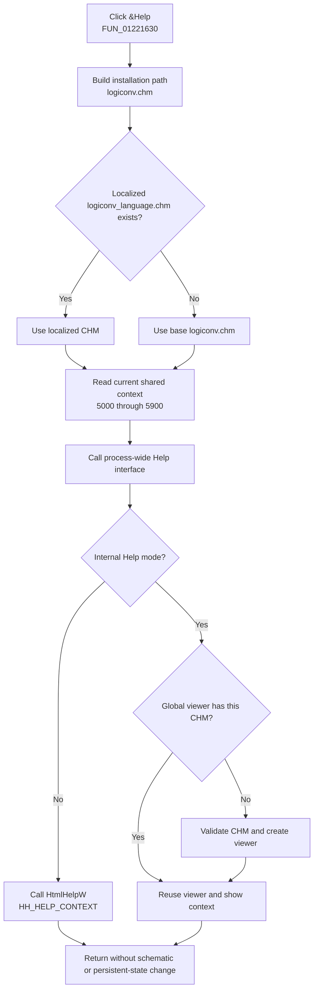

# Open context-sensitive Schematic Diagram help

> Analysis status: Complete. The DFM binding, handler, shared context writers, localized-help resolver, and internal and external Help paths support this explanation.

## Control

| Property | Recovered value |
| --- | --- |
| Form | Func_diagram_form |
| Form caption | Schematic diagram |
| Component path | Func_diagram_form.BtnHelp |
| Control class | TBitBtn |
| Caption | &Help |
| Hint | Not present in the recovered resource. |
| Handler name | BtnHelpClick |
| Handler address | 01221630 |
| Graph node | `resource:dfm:Func_diagram_form/Func_diagram_form.BtnHelp` |
| Handler node | `function:01221630` |
| Graph layer | UI |

## What happens when clicked

`TFunc_diagram_form.BtnHelpClick` builds this base Help path:

`<TINA installation folder>\logiconv.chm`

It passes that path to the shared localized-help resolver. The resolver inserts
an underscore and the current language marker before the extension. It uses
`logiconv_<language>.chm` when that file exists. Otherwise, it returns the
original `logiconv.chm` path without reporting an error.

The handler then reads the current shared Help context through
`PTR_DAT_02004708` and calls virtual method `+0x20` on the process-wide
application Help interface. Canonical tracing from the same interface resolves
that slot to the shared Help-context dispatcher `FUN_01d46890`.

The click does not use `Sender`, set a fixed context, or inspect the Help-call
result. It does not close the form, set a modal result, or change the schematic.

## Dynamic topic selection

The current context is live in-process state. Form creation, activation, and a
click on the form surface select the general context `5000`. Child controls
replace it before they perform their own command:

| Context | Writer in this form |
| --- | --- |
| `5000` | General Schematic Diagram form |
| `5100` | **Minterm** radio button |
| `5200` | **PLA minterm** radio button |
| `5300` | **Maxterm** radio button |
| `5400` | **PLA maxterm** radio button |
| `5500` | **Simplified function** check box |
| `5600` | **Save to FILE** button |
| `5700` | **Save to TINA** button |
| `5800` | **Save to MACRO** button |
| `5900` | **New Function** button |

`BtnHelpClick` sends whichever value is current at click time. It does not
derive a topic from focus, the selected radio button, a hit test, or a control
parameter. The form's `OnHelp` handler uses the same path, resolver, context
field, and application Help interface. Unlike that event handler, this button
handler does not update a handled flag or return an event status.

The recovered CHM topic names for IDs `5000` through `5900` are not available.
The writers and their bound control captions prove the context associations,
but they do not prove the title text inside the CHM.

## External and internal viewer paths

Bead `TIARA-diz.6.7.291` owns the canonical annotations for localized resolver
`FUN_01b1def0` and Help dispatcher `FUN_01d46890`. This article cites them and
does not duplicate their annotations.

The dispatcher branches on the application-wide mode flag at
`PTR_DAT_020017e8`:

- When the flag is zero, it initializes Windows HTML Help, resolves the CHM
  through the registered Help manager, obtains the registered owner window,
  and calls `HtmlHelpW` with `HH_HELP_CONTEXT` and the current numeric context.
- When the flag is nonzero, it uses the application's internal CHM viewer. It
  reuses the process-global viewer when it already owns the same CHM path. For
  another path or no current viewer, it constructs a viewer for the selected
  CHM, stores that viewer in the global slot, and asks it to show the current
  context.

Neither route opens a web URL or browser. A repeated click performs path and
language resolution again. The internal route can then reuse the current
viewer; the external route invokes Windows HTML Help again.

## Missing Help, errors, and persistence

- A missing localized file is a normal fallback to the base `logiconv.chm`.
  The localized resolver does not prove that the base file exists.
- In external mode, the wrapper returns zero if `hhctrl.ocx`, `HtmlHelpA`, or
  `HtmlHelpW` is unavailable. A zero result also remains possible from
  `HtmlHelpW`. The shared dispatcher and this button show no control-specific
  message, retry, or alternate URL for that result.
- In internal mode, a missing selected CHM raises an exception with the
  recovered suffix ` does not exist.`. Failure to extract uncached CHM data
  raises an exception with suffix ` could not extract help file.`.
- The handler has no local exception handler or rollback. Path construction,
  language resolution, dispatch, or internal-viewer exceptions propagate to
  the normal application exception path.
- A normal return finalizes the two temporary Delphi strings. The click does
  not write a file, registry value, project state, application setting, or
  persistent Help preference.
- External mode can initialize shared HTML Help state. Internal mode can create
  or replace the process-global viewer. These are shared Help-system effects,
  not changes to the Schematic Diagram model.

## Click flow

## Source evidence

- [Button handler `FUN_01221630`](../../../DecompiledSources/Tina16/functions/0000000001221630__FUN_01221630.c) concatenates the installation folder, path separator, and `logiconv.chm`; invokes the localized resolver; reads the shared context; and calls the application Help interface.
- [General-context handler `FUN_01221720`](../../../DecompiledSources/Tina16/functions/0000000001221720__FUN_01221720.c), [form creation `FUN_011d4840`](../../../DecompiledSources/Tina16/functions/00000000011D4840__FUN_011d4840.c), and [form activation `FUN_012209c0`](../../../DecompiledSources/Tina16/functions/00000000012209C0__FUN_012209c0.c) each store `5000` in the shared context field.
- [Minterm `FUN_012215a0`](../../../DecompiledSources/Tina16/functions/00000000012215A0__FUN_012215a0.c), [PLA minterm `FUN_01221510`](../../../DecompiledSources/Tina16/functions/0000000001221510__FUN_01221510.c), [Maxterm `FUN_01221480`](../../../DecompiledSources/Tina16/functions/0000000001221480__FUN_01221480.c), and [PLA maxterm `FUN_012213f0`](../../../DecompiledSources/Tina16/functions/00000000012213F0__FUN_012213f0.c) store contexts `5100` through `5400`.
- [Simplified function `FUN_01221380`](../../../DecompiledSources/Tina16/functions/0000000001221380__FUN_01221380.c), [Save to FILE `FUN_012207d0`](../../../DecompiledSources/Tina16/functions/00000000012207D0__FUN_012207d0.c), [Save to TINA `FUN_01220d20`](../../../DecompiledSources/Tina16/functions/0000000001220D20__FUN_01220d20.c), [Save to MACRO `FUN_01221000`](../../../DecompiledSources/Tina16/functions/0000000001221000__FUN_01221000.c), and [New Function `FUN_01221340`](../../../DecompiledSources/Tina16/functions/0000000001221340__FUN_01221340.c) store contexts `5500` through `5900`.
- [Form Help handler `FUN_01221750`](../../../DecompiledSources/Tina16/functions/0000000001221750__FUN_01221750.c) repeats the same Help request and handles the VCL Help event separately.
- [.291-owned localized resolver `FUN_01b1def0`](../../../DecompiledSources/Tina16/functions/0000000001B1DEF0__FUN_01b1def0.c) selects an existing language-specific CHM or returns the original path.
- [.291-owned Help dispatcher `FUN_01d46890`](../../../DecompiledSources/Tina16/functions/0000000001D46890__FUN_01d46890.c) implements the external and internal Help paths.
- [HTML Help loader `FUN_0042a4a0`](../../../DecompiledSources/Tina16/functions/000000000042A4A0__FUN_0042a4a0.c), [Unicode HTML Help wrapper `FUN_0042a560`](../../../DecompiledSources/Tina16/functions/000000000042A560__FUN_0042a560.c), [internal-viewer constructor `FUN_00b02f00`](../../../DecompiledSources/Tina16/functions/0000000000B02F00__FUN_00b02f00.c), and [internal context selector `FUN_00b046f0`](../../../DecompiledSources/Tina16/functions/0000000000B046F0__FUN_00b046f0.c) establish the shared viewer behavior and failure paths.
- [Recovered Delphi resource evidence](../../../DecompiledSources/Tina16/resources/dfm/ui-evidence.json) binds `BtnHelp.OnClick` to `01221630`, supplies caption **&Help**, and records `NumGlyphs = 2` with 482 embedded glyph bytes.

## Resource evidence

- The caption **&Help** supplies a keyboard mnemonic.
- The extracted [two-frame question-mark glyph](../../../glyph/0217_Func_diagram_form_Func_diagram_form_BtnHelp_Glyph_Data.png) is a 36 by 18 pixel PNG. It has the same recovered hash as other Help buttons. It supports the Help intent but does not identify the CHM or context.
- No hint, button kind, modal result, default state, cancel state, list item, action, or image-list reference is present.
- No nearby label is needed because the handler and Help infrastructure prove the behavior directly.

## Analysis limits and ownership

- `FUN_01221630` is the only function annotated by this control analysis.
- Bead `.291` owns `FUN_01b1def0` and `FUN_01d46890`. The string helpers,
  context writers, HTML Help wrappers, and internal-viewer helpers remain
  evidence only here.
- The exact installed path, current language marker, current context at click
  time, Help mode, CHM availability, and Help result are runtime values.
- The shared context is application-global. The recovered code does not prove
  that unrelated forms cannot replace it while this form remains open.
