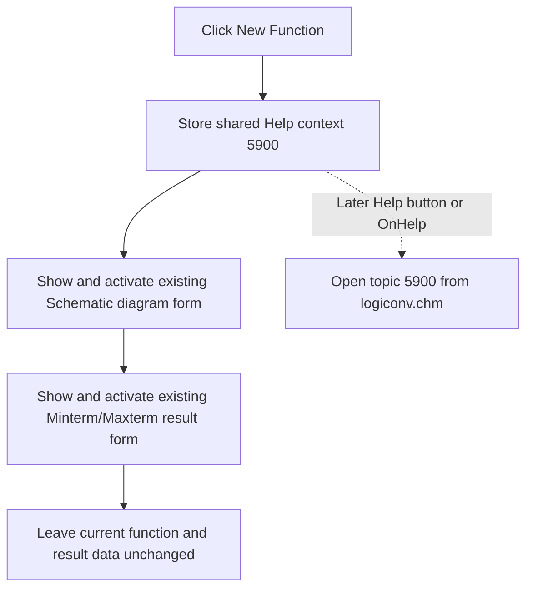

# Show the function diagram and Boolean-function results

`Btnoldnew` does not switch between old and new modes. Its recovered caption is `New Function`, but its click handler does not create, clear, copy, or transform a function. It selects Help topic 5900 and shows two existing modeless windows.

## Control

| Property | Recovered value |
| --- | --- |
| Form | Func_diagram_form |
| Component path | Func_diagram_form.Btnoldnew |
| Control class | TButton |
| Caption | New Function |
| Hint | Not present in the recovered resource. |
| Handler name | BtnoldnewClick |
| Handler address | 01221340 |
| Graph node | `resource:dfm:Func_diagram_form/Func_diagram_form.Btnoldnew` |
| Handler node | `function:01221340` |
| Graph layer | UI |

The button has no recovered hint, action, image, glyph, checked state, or modal result. The component name contains `oldnew`, but neither the DFM nor the handler exposes an Old mode.

## What happens when clicked

`FUN_01221340` performs three fixed operations without reading `Sender` or any form state:

1. It stores hexadecimal `0x170C`, decimal 5900, in the shared Help-context field addressed by `PTR_DAT_02004708`.
2. It passes the global object at `PTR_DAT_02003AF0` to the common modeless Show-and-activate wrapper. Cross-references from the form lifecycle and control handlers identify this object as the existing `Func_diagram_form`, whose recovered caption is `Schematic diagram`.
3. It passes the global object at `PTR_DAT_02001D60` to the same wrapper. Its creation and field users identify it as the existing `Function_wind_form`, whose recovered caption is `Minterm/Maxterm` and whose read-only fields display minterm, maxterm, and simplified results.

The result window is shown second, so the wrapper requests that it become the active foreground form after it makes both forms visible. Both objects are application singletons created by the logic-converter form initialization path. The click does not construct or free either form, and it does not use a modal result.

## No old/new transformation

The source contains no branch, old/new flag, caption update, input read, output allocation, or model call. It also does not clear the visible result fields. Existing function-diagram and result state is retained when the windows are already open.

The same two Show calls appear in `Func_diagram_form.OnDblClick`, without the Help-context store. This repeated path confirms that the application uses the click to reveal the two existing views, not to convert a stored Old function into a New one.

## Drawing and recalculation boundary

The click handler does not call a diagram renderer, Boolean minimizer, recalculation routine, invalidation routine, or data-transfer function. `FUN_008059a0` changes normal VCL visibility and activation state. If a form changes from hidden to visible, normal VCL show and activation events can run, but that is a window-lifecycle effect rather than a transformation requested by this handler.

Under the normal click path, `Func_diagram_form` is already visible and active because it owns the button. Showing it again is therefore normally idempotent. `Function_wind_form` has no recovered `OnShow` or `OnActivate` binding, so this click has no recovered result-recalculation event for that form. It presents values that other logic-converter paths have already prepared.

## Click flow

## Validation, errors, and persistence

- The handler has no input validation and no cancel or no-selection branch.
- Repeated clicks repeat the Help-context store and the two modeless Show requests. They do not add another form instance.
- The handler assumes both global form objects exist. It has no null guard, return-value check, exception handler, rollback, or error message.
- If a visibility or activation call fails, the earlier Help-context store and any earlier successful Show remain applied. There is no transactional rollback.
- The Help-context value remains in memory until another control or form lifecycle handler replaces it. A later Help button or form Help event combines it with `logiconv.chm` and calls the application Help service.
- No file, registry, project, settings, undo, or serializer function is called. The visibility and Help-context changes are not durable persistence.

## Source evidence

- [New Function handler `FUN_01221340`](../../../DecompiledSources/Tina16/functions/0000000001221340__FUN_01221340.c) stores `0x170C` and invokes the same wrapper for the two global objects.
- [Modeless Show-and-activate wrapper `FUN_008059a0`](../../../DecompiledSources/Tina16/functions/00000000008059A0__FUN_008059a0.c) sets visibility and then activates the supplied VCL object.
- [Logic-converter form initialization `FUN_01c98a00`](../../../DecompiledSources/Tina16/functions/0000000001C98A00__FUN_01c98a00.c) creates the two singleton form objects when their global pointers are null.
- [Schematic Diagram double-click handler `FUN_01221310`](../../../DecompiledSources/Tina16/functions/0000000001221310__FUN_01221310.c) repeats the same two Show calls and has no old/new operation.
- [Function result form creation `FUN_01b2aba0`](../../../DecompiledSources/Tina16/functions/0000000001B2ABA0__FUN_01b2aba0.c) initializes fields later read through `PTR_DAT_02001D60` by the Schematic Diagram form.
- [Schematic Diagram creation `FUN_011d4840`](../../../DecompiledSources/Tina16/functions/00000000011D4840__FUN_011d4840.c) reads those result-form fields and initializes its own controls and general Help context.
- [Help button handler `FUN_01221630`](../../../DecompiledSources/Tina16/functions/0000000001221630__FUN_01221630.c) and [form Help handler `FUN_01221750`](../../../DecompiledSources/Tina16/functions/0000000001221750__FUN_01221750.c) consume the shared context with `logiconv.chm`.
- [Recovered Delphi resource evidence](../../../DecompiledSources/Tina16/resources/dfm/ui-evidence.json) supplies the two form captions, result controls, New Function button caption, and event bindings.

## Ownership and limits

This analysis owns only `FUN_01221340`. The common VCL Show wrapper, form initialization, lifecycle handlers, Help service, drawing commands, and Boolean-function calculation paths are evidence only. The source proves that the handler opens existing views; it does not prove that the caption describes a separate New Function model state.
