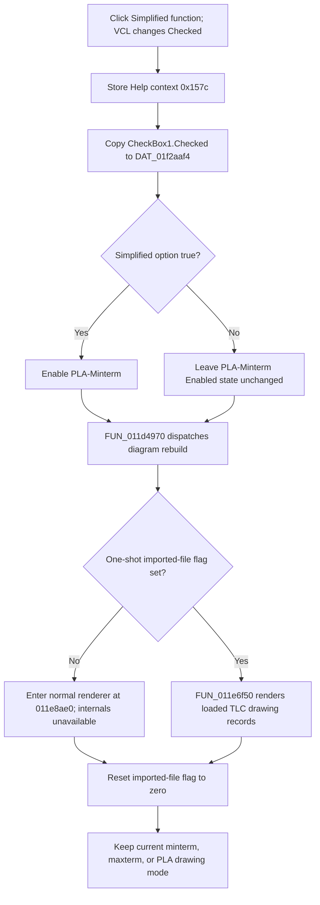

# Toggle the simplified-function diagram option

> Analysis status: Complete for the recovered control boundary. The DFM, published Delphi field table, checkbox handler, sibling drawing selectors, form lifecycle, shared redraw dispatcher, and save paths establish the behavior below. The normal renderer at `011e8ae0` timed out during decompilation, so the exact Boolean simplification and layout algorithm remains unknown.

## Control

| Property | Recovered value |
| --- | --- |
| Form | Func_diagram_form |
| Form caption | Schematic diagram |
| Component path | Func_diagram_form.CheckBox1 |
| Control class | TCheckBox |
| Caption | Simplified function |
| Initial checked state | true (`cbChecked`) |
| Handler name | CheckBox1Click |
| Handler address | 01221380 |
| Graph node | `resource:dfm:Func_diagram_form/Func_diagram_form.CheckBox1` |
| Handler node | `function:01221380` |
| Graph layer | UI |

The control has no recovered hint, text property, action, image, glyph, button kind, or modal result.

## What happens when clicked

VCL changes `CheckBox1.Checked` before it calls `FUN_01221380`. The handler then performs four ordered operations:

1. Stores Help context `0x157c` through `PTR_DAT_02004708`.
2. Reads `CheckBox1.Checked` from the published form field at `+0x738` and copies the Boolean to global byte `DAT_01f2aaf4`.
3. If the Boolean is true, enables the **PLA-Minterm** drawing button at form field `+0x6f0`. The false branch does not disable that button.
4. Calls shared redraw dispatcher `FUN_011d4970` with the form and cached image drawing surface `DAT_02107678`.

The direct effect proved by this handler is an in-memory simplified-function option byte plus an immediate diagram rebuild request. The handler does not edit the input truth table, Boolean expression, minterm or maxterm data, image size, or function name.

## Drawing-mode and control relationships

The simplified option is independent from the selected drawing representation. The adjacent Minterm, Maxterm, PLA-Minterm, and PLA-Maxterm button and radio handlers write a separate one-hot group at `DAT_01f2aaf0` through `DAT_01f2aaf3`. `CheckBox1Click` does not read or replace those four bytes, and it does not set any radio button's `Checked` state. The current minterm, maxterm, or PLA mode therefore remains selected when simplification changes.

The checkbox has one asymmetric direct control dependency:

- Checked enables **PLA-Minterm**.
- Unchecked does not disable **PLA-Minterm** and does not change the Enabled state of Minterm, Maxterm, PLA-Maxterm, **Save to FILE**, **Save to TINA**, or **Save to MACRO**.

Form activation has separate setup logic. It copies the current checkbox state to the same global byte, enables PLA-Minterm when checked, invokes the PLA-Minterm mode handler, and checks the parallel **PLA minterm** radio control. That setup explains the initial DFM combination of `Simplified function = true` and PLA-minterm drawing mode. It does not make the checkbox handler itself a radio or save-state coordinator.

**New Function** is also independent. Its handler shows the existing Schematic diagram and Minterm/Maxterm result forms. It does not read, reset, or recalculate the checkbox option. Despite the Minterm and Maxterm names, this form has no numeric edit, spin, range, or number-entry control for the checkbox to update.

## Redraw and calculation boundary

`FUN_011d4970` selects one of two rendering paths from one-shot byte `DAT_02107680`:

- A clear byte enters the normal Function Diagram renderer at recovered address `011e8ae0`. Form creation initializes the byte to zero, so this is the ordinary checkbox-click path.
- A set byte calls `FUN_011e6f50`, which renders a loaded TLC list of gate, output, wire, label, and coordinate records.

The dispatcher resets `DAT_02107680` to zero after either branch. The hidden file-load handler is the proved producer of value one. Drawing-mode, radio, checkbox, and save handlers all use the same dispatcher after they prepare their own state.

The function index records a timeout for `FUN_011e8ae0`, and no recovered C file exists for that entry. The source therefore does not prove whether `DAT_01f2aaf4` changes expression minimization, term selection, gate count, placement, or only presentation inside the normal renderer. It proves that the Boolean is available before the renderer runs and that the displayed image is rebuilt. This article does not invent the missing calculation details.

## Click flow

## Repeated clicks, errors, and partial state

- Every click copies the new checked state and requests a rebuild. There is no equality check or strict no-op branch.
- Enabling PLA-Minterm can be a VCL-level no-op when it is already enabled. Unchecking does not reverse that earlier enable operation.
- The handler accepts no text or number and has no validation, range, confirmation, cancel, or user-error branch.
- The handler and dispatcher have no local exception catch or rollback. A failure after the global write can leave `DAT_01f2aaf4` changed without a complete image rebuild.
- The dispatcher resets its imported-file byte only after the selected renderer returns. An exception can leave that one-shot byte set and change the branch used by a later redraw.
- Error handling inside the normal renderer is unknown because its decompilation timed out. The imported-record renderer returns no status to this handler.

## Persistence and later use

- The DFM starts the checkbox checked. Form activation reads that live control state into `DAT_01f2aaf4` again.
- The click changes process-memory state and the displayed image. It does not write a file, registry value, INI value, project setting, undo record, or modified flag.
- The file, TINA, and macro save handlers call the same redraw dispatcher before or after their own output operations. They do not serialize the checkbox Boolean as a recovered preference.
- Closing and recreating the form can restore the DFM default. The recovered path does not prove that a user change survives application restart.

## Source evidence

- [Checkbox handler `FUN_01221380`](../../../DecompiledSources/Tina16/functions/0000000001221380__FUN_01221380.c) stores the Help context, reads the checkbox, conditionally enables form field `+0x6f0`, and calls the dispatcher.
- [Form activation `FUN_012209c0`](../../../DecompiledSources/Tina16/functions/00000000012209C0__FUN_012209c0.c) repeats the checkbox read, applies initial control availability, selects PLA-minterm mode, and checks RadioButton2.
- [Form creation `FUN_011d4840`](../../../DecompiledSources/Tina16/functions/00000000011D4840__FUN_011d4840.c) initializes the normal-render flag, drawing controls, Save controls, and default radio state.
- [PLA-Minterm handler `FUN_012206d0`](../../../DecompiledSources/Tina16/functions/00000000012206D0__FUN_012206d0.c) proves the independent one-hot mode `0,0,1,0`, enables the three Save controls, and redraws. The other [Minterm](../../../DecompiledSources/Tina16/functions/00000000012205D0__FUN_012205d0.c), [Maxterm](../../../DecompiledSources/Tina16/functions/0000000001220650__FUN_01220650.c), and [PLA-Maxterm](../../../DecompiledSources/Tina16/functions/0000000001220750__FUN_01220750.c) handlers prove the remaining modes.
- [RadioButton1](../../../DecompiledSources/Tina16/functions/00000000012215A0__FUN_012215a0.c), [RadioButton2](../../../DecompiledSources/Tina16/functions/0000000001221510__FUN_01221510.c), [RadioButton3](../../../DecompiledSources/Tina16/functions/0000000001221480__FUN_01221480.c), and [RadioButton4](../../../DecompiledSources/Tina16/functions/00000000012213F0__FUN_012213f0.c) mirror those modes without reading `DAT_01f2aaf4`.
- [New Function handler `FUN_01221340`](../../../DecompiledSources/Tina16/functions/0000000001221340__FUN_01221340.c) only shows the two existing logic-converter views and does not touch simplified or drawing-mode state.
- [Form show `FUN_01221730`](../../../DecompiledSources/Tina16/functions/0000000001221730__FUN_01221730.c) caches the Image drawing surface in `DAT_02107678`.
- [Shared redraw dispatcher `FUN_011d4970`](../../../DecompiledSources/Tina16/functions/00000000011D4970__FUN_011d4970.c) selects normal or imported rendering and resets the one-shot flag.
- [Imported TLC renderer `FUN_011e6f50`](../../../DecompiledSources/Tina16/functions/00000000011E6F50__FUN_011e6f50.c) proves the alternate record-rendering branch. The [function index](../../../DecompiledSources/Tina16/functions/function-index.csv) records the normal `011e8ae0` entry as a decompilation timeout.
- [VCL Enabled setter `FUN_0064dc60`](../../../DecompiledSources/Tina16/functions/000000000064DC60__FUN_0064dc60.c) is the implementation behind virtual slot `+0x128`.
- [Recovered Delphi resource evidence](../../../DecompiledSources/Tina16/resources/dfm/ui-evidence.json) supplies the caption, initial checked state, form controls, and event binding. The recovered Delphi published-field table maps `+0x6f0` to `PLA_dmin`, `+0x710` through `+0x720` to the three Save buttons, `+0x738` to `CheckBox1`, and `+0x748` through `+0x760` to the four radio controls.

## Analysis limits and ownership

- This Bead owns unique checkbox handler `FUN_01221380` and shared redraw dispatcher `FUN_011d4970`.
- Sibling Beads own their direct drawing and radio handlers. The VCL setter, form lifecycle, save handlers, image helper, imported renderer, and New Function handler are evidence only here.
- The missing normal-renderer source prevents a specific claim about the simplification algorithm, calculation limits, layout differences, or internal error reporting.
- No source evidence supports durable persistence of the checkbox value.
