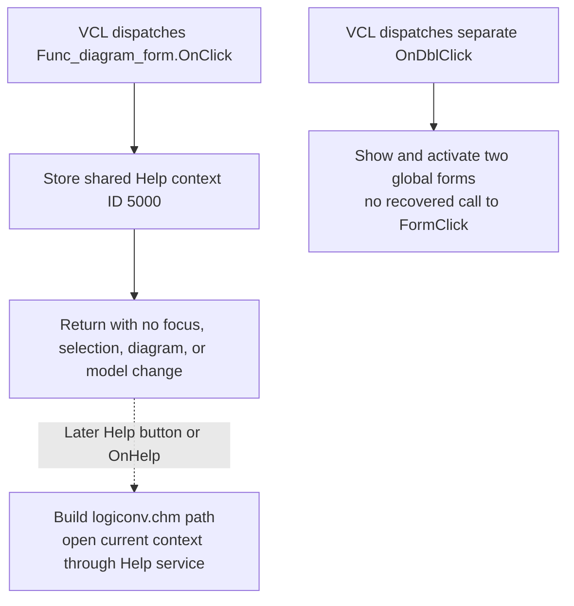

# Select the general Schematic Diagram help context

> Analysis status: Complete. The form binding, single-store handler, related form lifecycle handlers, sibling control context stores, Help handlers, and distinct double-click handler support this explanation.

## Control

| Property | Recovered value |
| --- | --- |
| Form | Func_diagram_form |
| Component path | Func_diagram_form |
| Control class | TFunc_diagram_form |
| Caption | Schematic diagram |
| Hint | Not present in the recovered resource. |
| Handler name | FormClick |
| Handler address | 01221720 |
| Graph node | `resource:dfm:Func_diagram_form` |
| Handler node | `function:01221720` |
| Graph layer | UI |

## What happens when clicked

The DFM binds the form's `OnClick` event to `FormClick`. `FUN_01221720` performs one operation: it stores decimal help-context ID `5000` in the shared application field addressed by `PTR_DAT_02004708`, then returns.

This restores the general topic for the Schematic Diagram form. Several child-control handlers write other IDs to the same field. For example, the New Function button writes `0x170c`, the Simplified function check box writes `0x157c`, and the four radio buttons write their own topic IDs. A later click on the form surface therefore replaces a control-specific topic with the general form topic.

The click does not open Help. `BtnHelpClick` and the form's `OnHelp` handler are the consumers: both build a `logiconv.chm` help path and pass the current shared context ID to the application Help service. Form creation and activation also store `5000`, so a repeated form click is idempotent when the general context is already active.

## Hit, focus, and model boundary

`FormClick` receives no recovered `Sender`, mouse coordinates, button state, or hit-test result. It does not inspect the diagram, a child control, or a selected object. The exact surface that causes the form event is therefore determined by VCL event dispatch and the child controls that cover the form, not by code in this handler.

The handler does not:

- change keyboard focus or the active control;
- select, create, delete, move, or edit a diagram item;
- change the four Boolean diagram-mode fields used by the term controls;
- update a radio button, check box, button, canvas, or status field;
- show, hide, activate, invalidate, or redraw a window; or
- call a model, backend, file, registry, project, or settings service.

Its only state change is the shared in-memory Help context.

## Double-click and drag relationship

The form has a separate `OnDblClick` binding to `FUN_01221310`. That handler calls the common modeless show-and-activate wrapper for two global form objects. It does not call `FUN_01221720` and it does not write the Help context. The recovered source does not establish whether VCL dispatch also sends a single-click event during a double-click sequence, so this article does not combine the two behaviors.

The DFM has no form-level `OnMouseDown`, `OnMouseMove`, or `OnMouseUp` binding, and `FUN_01221720` has no mouse-state read. No custom drag operation is part of this click path. Normal window movement through the operating-system title bar is outside this handler.

## No-op, errors, and persistence

- If the shared Help context already contains `5000`, the store repeats the same value and has no further visible effect.
- The handler has no input-dependent branch, validation, allocation, call, or expected error result.
- The single global store has no local exception handler. The recovered normal path always reaches `return`; no partial multi-step state exists to roll back.
- The click does not persist the context. Later control clicks, form creation, or activation can replace or restore it. No file, registry, project serializer, or settings writer is called.
- Clicking the form does not prove that Help is available. Missing CHM or Help-service errors can occur only when a later Help handler tries to open the topic.

## Click flow

## Source evidence

- [Form click handler `FUN_01221720`](../../../DecompiledSources/Tina16/functions/0000000001221720__FUN_01221720.c) contains only the store of `5000` through `PTR_DAT_02004708` and a return.
- [Form creation `FUN_011d4840`](../../../DecompiledSources/Tina16/functions/00000000011D4840__FUN_011d4840.c) initializes the same shared field to `5000` after it sets the initial form controls.
- [Form activation `FUN_012209c0`](../../../DecompiledSources/Tina16/functions/00000000012209C0__FUN_012209c0.c) restores `5000` after it refreshes diagram controls and before it updates the form text field.
- [Help button handler `FUN_01221630`](../../../DecompiledSources/Tina16/functions/0000000001221630__FUN_01221630.c) combines the application Help directory with `logiconv.chm` and passes the current shared context to the Help service.
- [Form Help handler `FUN_01221750`](../../../DecompiledSources/Tina16/functions/0000000001221750__FUN_01221750.c) uses the same CHM and context, marks the Help event handled, and returns true.
- [Double-click handler `FUN_01221310`](../../../DecompiledSources/Tina16/functions/0000000001221310__FUN_01221310.c) calls the shared [modeless show-and-activate wrapper `FUN_008059a0`](../../../DecompiledSources/Tina16/functions/00000000008059A0__FUN_008059a0.c) for two global objects and has no Help-context store.
- [New Function handler `FUN_01221340`](../../../DecompiledSources/Tina16/functions/0000000001221340__FUN_01221340.c), [Simplified function handler `FUN_01221380`](../../../DecompiledSources/Tina16/functions/0000000001221380__FUN_01221380.c), and the radio-button handlers demonstrate that child controls replace the same field with control-specific Help IDs.
- [Recovered Delphi resource evidence](../../../DecompiledSources/Tina16/resources/dfm/ui-evidence.json) binds the form-level `OnClick`, `OnDblClick`, lifecycle, and Help events and binds child controls to separate handlers.

## Resource evidence

- Form caption: `Schematic diagram`.
- The form has no recovered hint, text, action, image, glyph, modal result, checked state, or list items.
- The event source is the form resource itself, not a child diagram-control resource.
- No nearby label is needed to identify this behavior because the single-store handler and the Help consumers establish the role directly.

## Analysis limits and ownership

- `FUN_01221720` is the only function annotated by this control analysis. Its existing canonical graph fields are preserved exactly.
- The shared Help service, CHM path construction, modeless show wrapper, double-click handler, and `.575+` child-control handlers remain evidence only and are not redefined here.
- The recovered source does not expose a symbolic Delphi field name for `PTR_DAT_02004708`; its writers and Help consumers establish its Help-context responsibility.
- The source does not recover the titles or ownership of the two global forms activated by `OnDblClick`, so this article does not assign them names.
